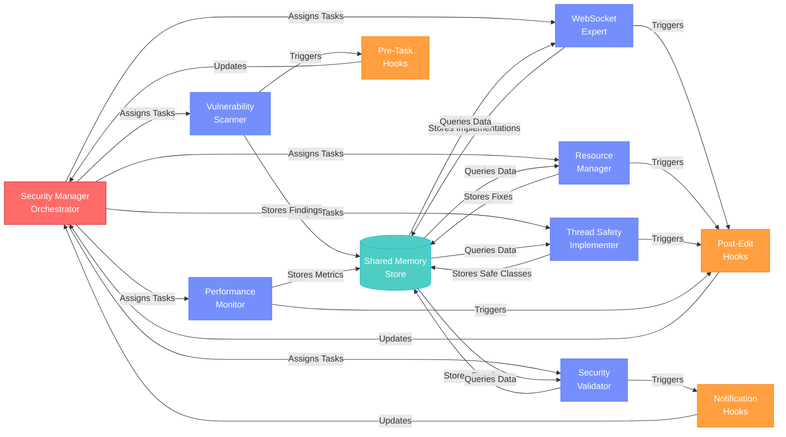
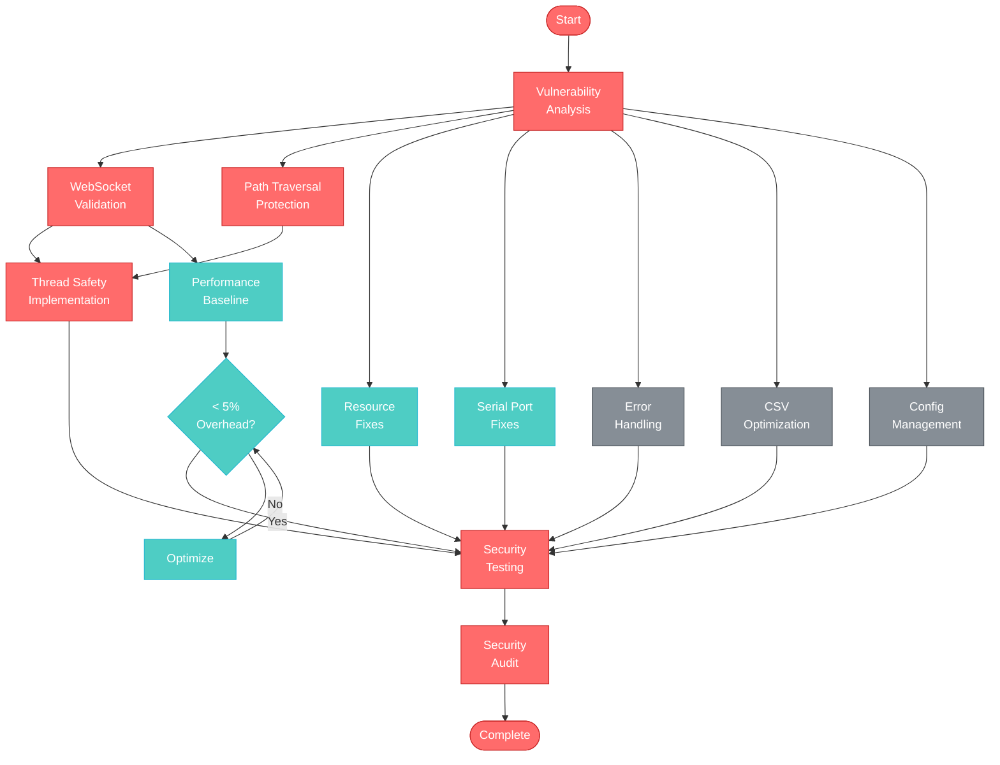

# CodeRabbit Fixes - Claude Flow Agent Execution Flow

## Overview
This diagram illustrates the parallel execution flow of Claude Flow agents implementing CodeRabbit security fixes for PR #46.

## Execution Flow Diagram

## Execution Timeline

```mermaid
gantt
    title CodeRabbit Fixes Implementation Timeline (180 minutes)
    dateFormat HH:mm
    axisFormat %H:%M
    
    section Initialization
    Swarm Setup           :active, init1, 00:00, 5m
    Agent Spawning        :active, init2, after init1, 5m
    
    section Phase 1 Analysis
    Vulnerability Scan    :crit, p1a, after init2, 10m
    Priority Mapping      :crit, p1b, after init2, 10m
    Memory Storage        :p1c, after p1a, 5m
    Coordination          :p1d, after init2, 20m
    
    section Phase 2 Security
    WebSocket Valid       :crit, p2a, after p1c, 20m
    Path Traversal        :crit, p2b, after p1c, 15m
    Resource Fixes        :crit, p2c, after p1c, 15m
    Serial Port           :p2d, after p1c, 10m
    
    section Phase 3 Threading
    Thread Analysis       :crit, p3a, after p2a, 15m
    Lock Implementation   :crit, p3b, after p3a, 15m
    Race Condition Fix    :crit, p3c, after p3b, 10m
    Testing              :p3d, after p3c, 5m
    
    section Phase 4 Testing
    Test Creation        :crit, p4a, after p3c, 15m
    Test Execution       :crit, p4b, after p4a, 15m
    Performance Check    :p4c, after p2a, 10m
    Integration Tests    :p4d, after p4b, 5m
    
    section Validation
    Security Audit       :crit, p5a, after p4d, 5m
    Documentation        :p5b, after p5a, 5m
```

## Agent Coordination Flow

## Critical Path Analysis

## Key Execution Principles

### 1. **Parallel Execution**
- All 7 agents spawn simultaneously
- Independent tasks execute in parallel
- Shared memory enables coordination without blocking

### 2. **Priority-Based Implementation**
- CRITICAL vulnerabilities (WebSocket, Path Traversal) first
- HIGH priority issues (Resource leaks, Thread safety) second
- MEDIUM priority optimizations last

### 3. **Continuous Validation**
- Each implementation immediately tested
- Performance monitored throughout
- Security audit as final gate

### 4. **Memory-Based Coordination**
- Agents share findings via memory store
- No direct agent-to-agent communication
- Security Manager orchestrates via memory queries

### 5. **Hook-Driven Synchronization**
- Pre-task hooks for context loading
- Post-edit hooks for progress tracking
- Notification hooks for milestone updates

This execution flow ensures all 45+ CodeRabbit issues are systematically addressed with proper prioritization and validation.