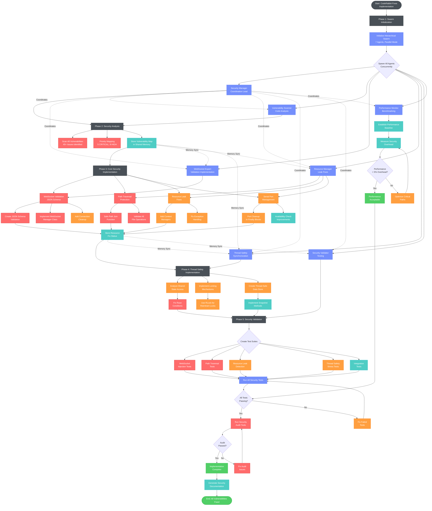
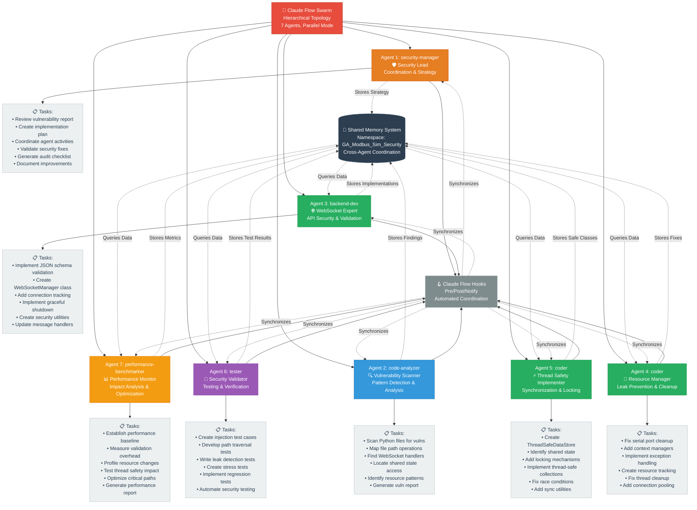
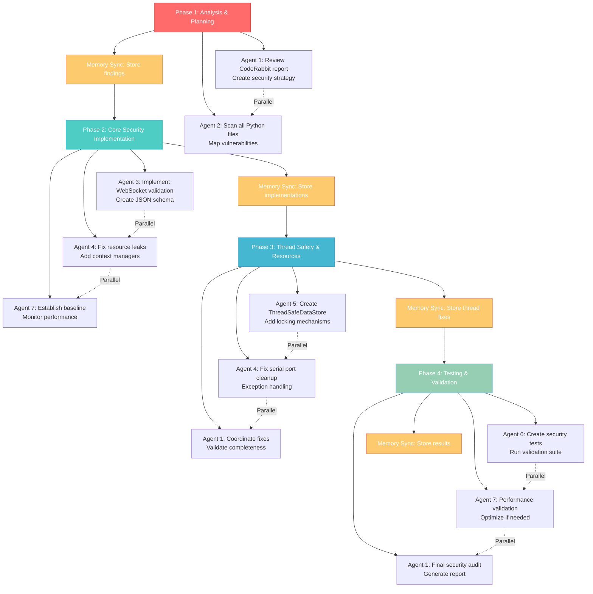

# CodeRabbit Fixes - Claude Flow Agent Execution Flow

## Overview
This diagram illustrates the parallel execution flow of Claude Flow agents implementing CodeRabbit security fixes for PR #46.

## Execution Flow Diagram



## Execution Timeline

```mermaid
gantt
    title CodeRabbit Fixes Implementation Timeline (180 minutes)
    dateFormat HH:mm
    axisFormat %H:%M
    
    section Initialization
    Swarm Setup           :active, init1, 00:00, 5m
    Agent Spawning        :active, init2, after init1, 5m
    
    section Phase 1 Analysis
    Vulnerability Scan    :crit, p1a, after init2, 10m
    Priority Mapping      :crit, p1b, after init2, 10m
    Memory Storage        :p1c, after p1a, 5m
    Coordination          :p1d, after init2, 20m
    
    section Phase 2 Security
    WebSocket Valid       :crit, p2a, after p1c, 20m
    Path Traversal        :crit, p2b, after p1c, 15m
    Resource Fixes        :crit, p2c, after p1c, 15m
    Serial Port           :p2d, after p1c, 10m
    
    section Phase 3 Threading
    Thread Analysis       :crit, p3a, after p2a, 15m
    Lock Implementation   :crit, p3b, after p3a, 15m
    Race Condition Fix    :crit, p3c, after p3b, 10m
    Testing              :p3d, after p3c, 5m
    
    section Phase 4 Testing
    Test Creation        :crit, p4a, after p3c, 15m
    Test Execution       :crit, p4b, after p4a, 15m
    Performance Check    :p4c, after p2a, 10m
    Integration Tests    :p4d, after p4b, 5m
    
    section Validation
    Security Audit       :crit, p5a, after p4d, 5m
    Documentation        :p5b, after p5a, 5m
```



## Agent Orchestration & Task Allocation



## Detailed Agent Specializations

```mermaid
graph LR
    %% Define styles for agent types
    classDef security fill:#e74c3c,stroke:#c0392b,color:#fff,font-weight:bold
    classDef analyzer fill:#3498db,stroke:#2980b9,color:#fff,font-weight:bold
    classDef backend fill:#27ae60,stroke:#229954,color:#fff,font-weight:bold
    classDef coder fill:#f39c12,stroke:#e67e22,color:#fff,font-weight:bold
    classDef tester fill:#9b59b6,stroke:#8e44ad,color:#fff,font-weight:bold
    classDef monitor fill:#e67e22,stroke:#d35400,color:#fff,font-weight:bold
    classDef file fill:#ecf0f1,stroke:#95a5a6,color:#2c3e50
    classDef critical fill:#c0392b,stroke:#a93226,color:#fff

    %% Agent Types and File Assignments
    subgraph "🛡️ Security Manager (security-manager)"
        SM[Security Lead]:::security
        SM_FILES[Files:<br/>• CODERABBIT_FIXES.md (read)<br/>• security_plan.md (create)<br/>• audit_checklist.md (create)]:::file
    end
    
    subgraph "🔍 Vulnerability Scanner (code-analyzer)"
        VS[Pattern Detection]:::analyzer
        VS_FILES[Files:<br/>• All .py files (scan)<br/>• vulnerability_map.json (create)<br/>• security_report.md (create)]:::file
    end
    
    subgraph "🌐 WebSocket Expert (backend-dev)"
        WE[API Security]:::backend
        WE_FILES[Files:<br/>• modbus_dashboard.py (modify)<br/>• validation.py (create)<br/>• websocket_manager.py (create)]:::file
    end
    
    subgraph "🔧 Resource Manager (coder)"
        RM[Leak Prevention]:::coder
        RM_FILES[Files:<br/>• modbus_server.py (modify)<br/>• modbus_standalone_logger.py (modify)<br/>• resources.py (create)]:::file
    end
    
    subgraph "⚡ Thread Safety (coder)"
        TS[Synchronization]:::coder
        TS_FILES[Files:<br/>• data_manager.py (modify)<br/>• threading.py (create)<br/>• thread_safe_store.py (create)]:::file
    end
    
    subgraph "🧪 Security Validator (tester)"
        SV[Testing]:::tester
        SV_FILES[Files:<br/>• test_validation.py (create)<br/>• test_security.py (create)<br/>• test_threading.py (create)]:::file
    end
    
    subgraph "📊 Performance Monitor (performance-benchmarker)"
        PM[Impact Analysis]:::monitor
        PM_FILES[Files:<br/>• benchmark_security.py (create)<br/>• performance_report.json (create)<br/>• optimization_log.md (create)]:::file
    end
    
    %% Critical Fixes Assignment
    CRITICAL_FIXES[🚨 CRITICAL FIXES<br/>WebSocket Injection<br/>Path Traversal<br/>Resource Leaks<br/>Thread Safety<br/>Serial Port Cleanup]:::critical
    
    %% Agent to Critical Fix Mapping
    VS --> CRITICAL_FIXES
    WE --> CRITICAL_FIXES
    RM --> CRITICAL_FIXES
    TS --> CRITICAL_FIXES
```

## Task Execution Matrix



## Critical Path Analysis


## Key Execution Principles

### 1. **Parallel Execution**
- All 7 agents spawn simultaneously
- Independent tasks execute in parallel
- Shared memory enables coordination without blocking

### 2. **Priority-Based Implementation**
- CRITICAL vulnerabilities (WebSocket, Path Traversal) first
- HIGH priority issues (Resource leaks, Thread safety) second
- MEDIUM priority optimizations last

### 3. **Continuous Validation**
- Each implementation immediately tested
- Performance monitored throughout
- Security audit as final gate

### 4. **Memory-Based Coordination**
- Agents share findings via memory store
- No direct agent-to-agent communication
- Security Manager orchestrates via memory queries

### 5. **Hook-Driven Synchronization**
- Pre-task hooks for context loading
- Post-edit hooks for progress tracking
- Notification hooks for milestone updates

This execution flow ensures all 45+ CodeRabbit issues are systematically addressed with proper prioritization and validation.

## Agent Type Specifications & Capabilities

| Agent # | Agent Type | Specialization | Primary Files | Key Capabilities |
|---------|------------|----------------|---------------|------------------|
| **1** | `security-manager` | 🛡️ **Security Lead** | CODERABBIT_FIXES.md, security_plan.md | Strategic coordination, vulnerability prioritization, audit validation |
| **2** | `code-analyzer` | 🔍 **Vulnerability Scanner** | All Python files, vulnerability_map.json | Pattern detection, static analysis, security scanning |
| **3** | `backend-dev` | 🌐 **WebSocket Expert** | modbus_dashboard.py, validation.py | API security, message validation, connection management |
| **4** | `coder` | 🔧 **Resource Manager** | modbus_server.py, resources.py | Resource leak prevention, context management, cleanup |
| **5** | `coder` | ⚡ **Thread Safety** | data_manager.py, threading.py | Synchronization, locking, race condition prevention |  
| **6** | `tester` | 🧪 **Security Validator** | test_*.py files | Security testing, injection tests, validation suites |
| **7** | `performance-benchmarker` | 📊 **Performance Monitor** | benchmark_security.py | Performance analysis, overhead measurement, optimization |

## Agent Coordination Patterns

### **Hierarchical Leadership**
- **Security Manager** (Agent 1) acts as the orchestrating leader
- All other agents report findings and progress to shared memory
- Coordination happens through memory queries, not direct communication

### **Parallel Execution Phases**
1. **Phase 1** (30 min): Agents 1 & 2 analyze vulnerabilities in parallel
2. **Phase 2** (60 min): Agents 3, 4 & 7 implement core fixes simultaneously  
3. **Phase 3** (45 min): Agents 4, 5 & 1 handle threading and resource cleanup
4. **Phase 4** (45 min): Agents 6, 7 & 1 validate and audit in parallel

### **Memory-Based Synchronization**
- **Namespace**: `GA_Modbus_Sim_Security` prevents cross-project contamination
- **Key Pattern**: `swarm/{agent_id}/{task_type}` for organized storage
- **Query Pattern**: Agents query previous findings before starting work

### **Hook-Driven Automation**
- **Pre-task**: Context loading and dependency checking
- **Post-edit**: Progress tracking and memory updates  
- **Notification**: Milestone completion and status updates

This orchestration reduces the estimated 40-50 hour manual implementation to 180 minutes through intelligent parallel coordination.