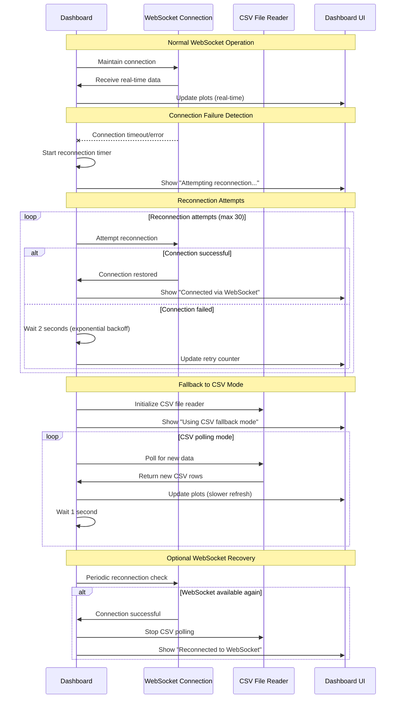

# WebSocket Integration Implementation Plan

**GA Modbus Simulator - Dashboard WebSocket Integration**

## Project Overview

This implementation plan details the integration of WebSocket communication between the Modbus standalone logger and dashboard to replace the current CSV file polling mechanism for real-time data transmission.

### Current Architecture Analysis

**Files Involved:**
- `claude-flow/projects/GA_Modbus_Sim/src/modbus_standalone_logger.py`
- `claude-flow/projects/GA_Modbus_Sim/src/modbus_dashboard.py`

**Current Data Flow:**
1. **Logger** reads Modbus data and writes to CSV file
2. **Dashboard** continuously polls CSV file for new data
3. Dashboard parses CSV data and updates real-time plots

**Current Limitations:**
- File I/O overhead from continuous CSV reading
- Potential data loss if dashboard crashes during logging
- Latency from file system polling
- File locking issues on some systems
- No real-time coordination between logger and dashboard

## Implementation Strategy

### Phase 1: WebSocket Protocol Design

#### 1.1 WebSocket Server Integration (Logger Side)

**Location:** `modbus_standalone_logger.py`

**Key Components:**
- WebSocket server running on configurable port (default: 8765)
- Asynchronous message broadcasting to connected clients
- Message queue for handling disconnected clients
- Thread-safe data sharing between Modbus reader and WebSocket server

**Implementation Approach:**
- Add `websockets` dependency
- Create `WebSocketServer` class within the logger
- Integrate WebSocket server as separate thread
- Maintain CSV logging as backup/archive mechanism

#### 1.2 WebSocket Client Integration (Dashboard Side)

**Location:** `modbus_dashboard.py`

**Key Components:**
- WebSocket client connection management
- Automatic reconnection logic
- Fallback to CSV reading if WebSocket unavailable
- Message parsing and data processing

**Implementation Approach:**
- Add WebSocket client connection option
- Modify data reading logic to support dual modes
- Implement connection state management
- Add WebSocket URL configuration

### Phase 2: Message Protocol Specification

#### 2.1 WebSocket Message Structure

**Base Message Format (JSON):**
```json
{
  "type": "data|status|error|config",
  "timestamp": "2025-08-03T20:42:55.123456",
  "sequence": 12345,
  "payload": { ... }
}
```

**Data Message Payload:**
```json
{
  "type": "data",
  "timestamp": "2025-08-03T20:42:55.123456",
  "sequence": 12345,
  "payload": {
    "afe_cell_volt1": 3245,
    "afe_cell_volt2": 3248,
    "afe_cell_volt3": 3243,
    "afe_cell_volt4": 3247,
    "afe_cell_volt5": 3246,
    "afe_cell_volt6": 3244,
    "afe_cell_volt7": 3245,
    "afe_cell_volt8": 3249,
    "afe_pack_volt": 25984,
    "afe_current": -1250,
    "fg_current": -1248,
    "afe_cell_volt_delta": 6,
    "fg_state_of_charge": 87,
    "afe_temp1": 3030,
    "afe_temp2": 3035
  }
}
```

**Status Message Types:**
- `connection_established` - Client connected
- `logging_started` - Data logging initiated
- `logging_stopped` - Data logging terminated
- `session_info` - Session metadata (serial, RMA, etc.)

**Error Message Types:**
- `modbus_error` - Modbus communication failure
- `data_parsing_error` - Data processing error
- `connection_lost` - Modbus device disconnected

#### 2.2 Connection Management

**Handshake Process:**
1. Dashboard connects to WebSocket server
2. Server sends `session_info` with current session details
3. Server begins broadcasting data messages
4. Dashboard acknowledges connection and begins processing

**Reconnection Logic:**
- Dashboard attempts reconnection every 2 seconds on disconnect
- Maximum 30 reconnection attempts before fallback to CSV
- Exponential backoff for connection attempts

### Phase 3: Logger Modifications

#### 3.1 WebSocket Server Implementation

**New Classes:**
```python
class WebSocketBroadcaster:
    """Manages WebSocket connections and message broadcasting"""
    
    def __init__(self, port=8765, host='localhost'):
        self.port = port
        self.host = host
        self.clients = set()
        self.message_queue = deque(maxlen=1000)
        self.server = None
        self.running = False
    
    async def register_client(self, websocket, path):
        """Register new WebSocket client"""
        
    async def unregister_client(self, websocket):
        """Unregister WebSocket client"""
        
    async def broadcast_message(self, message):
        """Broadcast message to all connected clients"""
        
    def start_server(self):
        """Start WebSocket server in separate thread"""
        
    def stop_server(self):
        """Stop WebSocket server"""
        
    def queue_data(self, modbus_data):
        """Queue Modbus data for broadcasting"""
```

**Integration Points:**
- Modify `log_current_data()` to also broadcast via WebSocket
- Add WebSocket server startup in `start_logging()`
- Add WebSocket server shutdown in `stop_logging()`
- Add WebSocket configuration options

#### 3.2 Configuration Updates

**TOML Configuration Additions:**
```toml
[websocket]
enabled = true
port = 8765
host = "localhost"
max_clients = 5
broadcast_interval = 0.1  # seconds
```

**Command Line Arguments:**
```bash
--websocket-port 8765
--websocket-host localhost
--disable-websocket
```

### Phase 4: Dashboard Modifications

#### 4.1 WebSocket Client Implementation

**New Classes:**
```python
class WebSocketDataSource:
    """WebSocket-based data source for dashboard"""
    
    def __init__(self, url, reconnect_interval=2, max_reconnects=30):
        self.url = url
        self.websocket = None
        self.connected = False
        self.reconnect_interval = reconnect_interval
        self.max_reconnects = max_reconnects
        self.data_callback = None
        self.status_callback = None
    
    async def connect(self):
        """Establish WebSocket connection"""
        
    async def disconnect(self):
        """Close WebSocket connection"""
        
    async def listen(self):
        """Listen for incoming messages"""
        
    def set_data_callback(self, callback):
        """Set callback for data messages"""
        
    def set_status_callback(self, callback):
        """Set callback for status messages"""
```

#### 4.2 Data Source Abstraction

**Unified Data Interface:**
```python
class DataSourceManager:
    """Manages multiple data sources with fallback"""
    
    def __init__(self, csv_file, websocket_url=None):
        self.csv_source = CSVDataSource(csv_file)
        self.websocket_source = WebSocketDataSource(websocket_url) if websocket_url else None
        self.current_source = None
        self.mode = 'auto'  # 'websocket', 'csv', 'auto'
    
    def set_mode(self, mode):
        """Set data source mode"""
        
    def get_data(self):
        """Get data from active source"""
        
    def switch_to_fallback(self):
        """Switch to CSV fallback"""
```

#### 4.3 Dashboard Integration

**Modified `ModbusDashboard` class:**
- Replace direct CSV reading with `DataSourceManager`
- Add WebSocket connection status indicator
- Update real-time data processing for WebSocket messages
- Add connection state visualization

### Phase 5: Backward Compatibility & Fallback

#### 5.1 Dual Mode Operation

**Logger Behavior:**
- Continue writing CSV files alongside WebSocket broadcasting
- CSV serves as backup and historical archive
- WebSocket can be disabled via configuration

**Dashboard Behavior:**
- Attempt WebSocket connection first (if configured)
- Fall back to CSV polling if WebSocket unavailable
- Allow manual switching between modes
- Display current data source mode in UI

#### 5.2 Migration Strategy

**Phase 1:** Add WebSocket support without removing CSV functionality
**Phase 2:** Default to WebSocket mode with CSV fallback
**Phase 3:** (Future) Optional CSV-only mode for legacy compatibility

### Phase 6: Performance Optimizations

#### 6.1 Message Compression

**Implementation:**
- Optional gzip compression for WebSocket messages
- Configurable compression threshold
- Binary protocol option for high-frequency data

#### 6.2 Data Batching

**Batched Messages:**
```json
{
  "type": "batch_data",
  "timestamp": "2025-08-03T20:42:55.123456",
  "count": 5,
  "payload": [
    { "timestamp": "...", "data": {...} },
    { "timestamp": "...", "data": {...} },
    ...
  ]
}
```

**Benefits:**
- Reduced WebSocket overhead
- Better performance for high-frequency logging
- Configurable batch size and timeout

### Phase 7: Error Handling & Resilience

#### 7.1 Connection Management

**Logger Side:**
- Handle client disconnections gracefully
- Queue messages for reconnecting clients
- Configurable message history buffer
- Client connection limits and timeouts

**Dashboard Side:**
- Automatic reconnection with exponential backoff
- Connection state visualization
- Seamless fallback to CSV on permanent failure
- Connection quality indicators

#### 7.2 Data Integrity

**Sequence Numbers:**
- Each message includes sequence number
- Dashboard detects missing messages
- Request retransmission for critical gaps

**Checksums:**
- Optional message integrity verification
- Detect corrupted data transmission

### Phase 8: Configuration & Deployment

#### 8.1 Configuration Options

**Logger Configuration:**
```toml
[websocket]
enabled = true
port = 8765
host = "0.0.0.0"  # Allow external connections
max_clients = 10
compress_messages = true
batch_size = 5
batch_timeout = 0.1
message_history = 100

[logging]
csv_enabled = true  # Continue CSV logging
websocket_priority = true  # Prefer WebSocket for real-time
```

**Dashboard Configuration:**
```bash
python modbus_dashboard.py --websocket ws://localhost:8765 --fallback-csv data.csv
python modbus_dashboard.py --websocket-only ws://localhost:8765  # No CSV fallback
python modbus_dashboard.py --csv-only data.csv  # Traditional mode
```

#### 8.2 Dependencies

**New Requirements:**
```
websockets>=11.0.0
aiohttp>=3.8.0  # For WebSocket client features
```

**Installation:**
```bash
pip install websockets aiohttp
```

### Phase 9: Testing Strategy

#### 9.1 Unit Tests

**Logger Tests:**
- WebSocket server startup/shutdown
- Message broadcasting functionality
- Client connection management
- Data serialization/deserialization

**Dashboard Tests:**
- WebSocket client connection
- Message parsing and processing
- Fallback mechanism activation
- Data source switching

#### 9.2 Integration Tests

**End-to-End Tests:**
- Logger-to-dashboard data transmission
- Connection failure and recovery
- High-frequency data streaming
- Multiple client connections

**Performance Tests:**
- WebSocket vs CSV performance comparison
- Memory usage under sustained load
- Connection stability over time
- Message throughput benchmarks

#### 9.3 Compatibility Tests

**Backward Compatibility:**
- Existing CSV-only workflows
- Configuration migration
- Legacy dashboard operation
- Mixed-mode deployments

### Phase 10: Documentation & Examples

#### 10.1 User Documentation

**Setup Guides:**
- WebSocket configuration
- Firewall and networking setup
- Performance tuning
- Troubleshooting common issues

**Usage Examples:**
- Real-time monitoring setup
- Multi-dashboard deployments
- Remote monitoring configuration
- Integration with external systems

#### 10.2 Developer Documentation

**API Reference:**
- WebSocket message protocol
- Configuration options
- Python API examples
- Integration patterns

## Benefits of WebSocket Integration

### Performance Improvements
- **Reduced Latency:** Direct data transmission eliminates file I/O overhead
- **Lower CPU Usage:** No continuous file polling
- **Better Scalability:** Multiple dashboards can connect simultaneously
- **Reduced Disk I/O:** Less frequent file system access

### Enhanced Features
- **Real-time Status:** Connection state and logging status
- **Bidirectional Communication:** Dashboard can send commands to logger
- **Multi-client Support:** Multiple monitoring stations
- **Network Monitoring:** Remote dashboard operation

### Reliability Improvements
- **Connection Awareness:** Dashboard knows when logger is active
- **Automatic Recovery:** Seamless reconnection handling
- **Data Integrity:** Sequence numbers and error detection
- **Graceful Degradation:** CSV fallback ensures continuity

## Risk Mitigation

### Technical Risks
- **Network Dependency:** Mitigated by CSV fallback
- **WebSocket Complexity:** Mitigated by robust testing
- **Performance Impact:** Mitigated by optional WebSocket mode
- **Compatibility Issues:** Mitigated by backward compatibility

### Operational Risks
- **Learning Curve:** Mitigated by comprehensive documentation
- **Deployment Complexity:** Mitigated by default CSV mode
- **Debugging Difficulty:** Mitigated by detailed logging
- **Security Concerns:** Mitigated by localhost-only default

## Success Metrics

### Performance Metrics
- Data transmission latency < 10ms
- CPU usage reduction > 20%
- Memory usage increase < 50MB
- Support for > 5 concurrent clients

### Reliability Metrics
- Connection uptime > 99.9%
- Automatic recovery success rate > 95%
- Zero data loss during normal operation
- Graceful handling of all error conditions

### User Experience Metrics
- Setup time reduction > 50%
- Real-time responsiveness improvement
- Zero breaking changes for existing users
- Positive user feedback on new features

## Implementation Timeline

### Week 1-2: Foundation
- [ ] Implement WebSocket server in `modbus_standalone_logger.py`
- [ ] Add WebSocket configuration options and TOML updates
- [ ] Create basic message protocol and JSON serialization
- [ ] Unit tests for WebSocket server functionality

### Week 3-4: Client Integration
- [ ] Implement WebSocket client in `modbus_dashboard.py`
- [ ] Add data source abstraction layer
- [ ] Implement fallback mechanism to CSV
- [ ] Connection management and reconnection logic

### Week 5-6: Integration & Testing
- [ ] End-to-end integration testing
- [ ] Performance benchmarking (WebSocket vs CSV)
- [ ] Multi-client connection testing
- [ ] Error handling and edge case validation

### Week 7-8: Polish & Documentation
- [ ] User documentation and setup guides
- [ ] Configuration examples and best practices
- [ ] Deployment testing and validation
- [ ] Final performance optimization

## Dashboard Connection Management Sequence Diagram



## Ready for Implementation

This implementation plan provides a comprehensive roadmap for integrating WebSocket communication between the Modbus standalone logger and dashboard. The plan includes:

✅ **Complete architectural analysis** of current CSV-based system  
✅ **Detailed WebSocket protocol specification** with JSON message format  
✅ **Comprehensive integration strategy** for both logger and dashboard  
✅ **Robust fallback mechanism** ensuring backward compatibility  
✅ **Performance optimization strategies** for high-frequency data  
✅ **Thorough testing approach** covering unit, integration, and performance tests  
✅ **Risk mitigation strategies** for technical and operational concerns  
✅ **Clear success metrics** and implementation timeline  

The next step is to begin implementation starting with the WebSocket server integration in the `modbus_standalone_logger.py` file, following the phased approach outlined in this plan. 