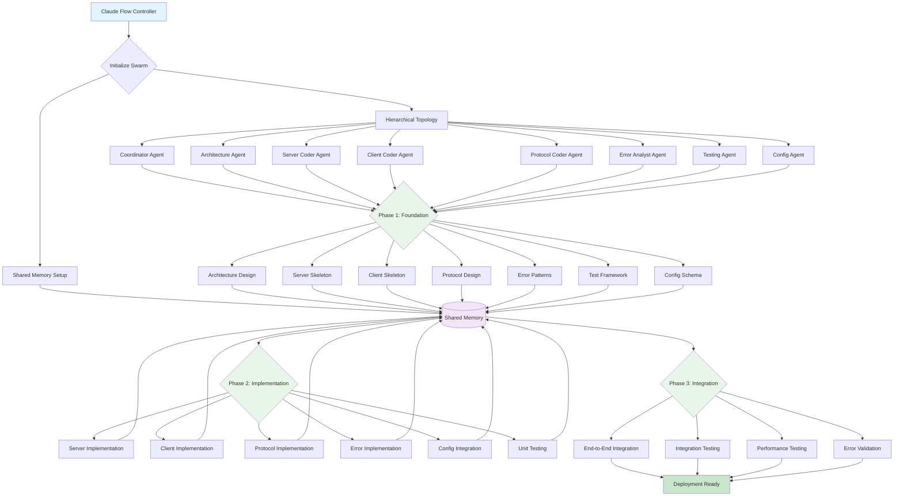
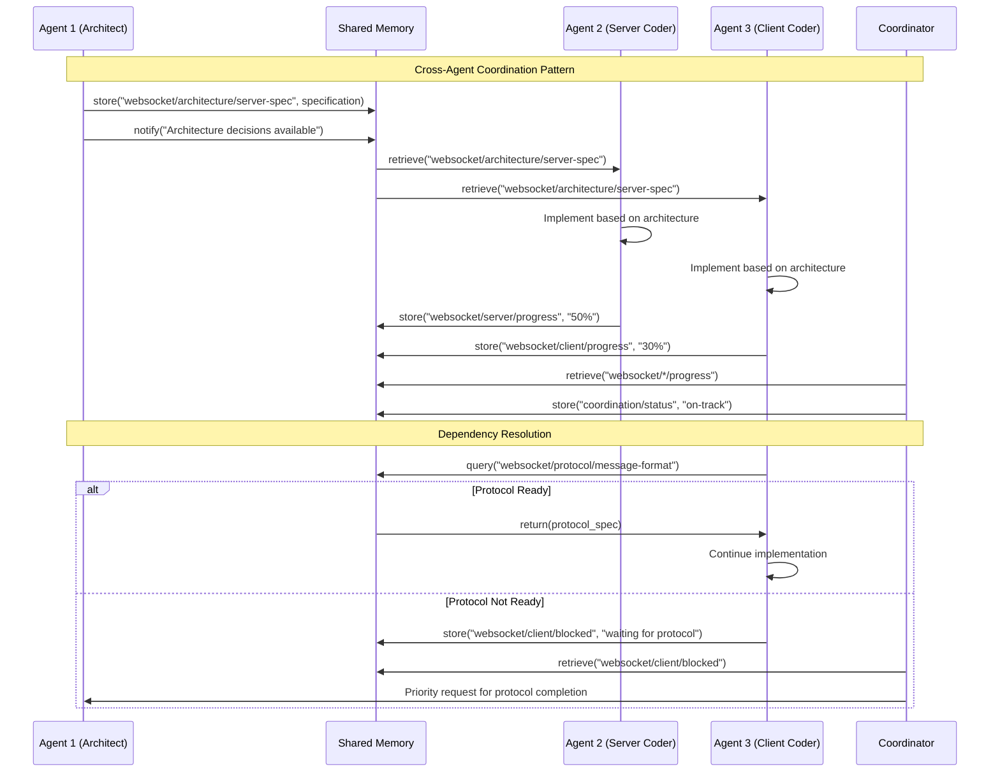

# Claude Flow WebSocket Implementation Sequence Diagram

## Claude Flow Agent Coordination for WebSocket Integration

```mermaid
sequenceDiagram
    participant User as Developer
    participant CF as Claude Flow Controller
    participant Memory as Shared Memory
    participant Architect as Architecture Agent
    participant ServerCoder as Server Coder Agent
    participant ClientCoder as Client Coder Agent
    participant ProtocolCoder as Protocol Coder Agent
    participant ErrorAnalyst as Error Handling Agent
    participant Tester as Testing Agent
    participant ConfigCoder as Config Agent
    participant Coordinator as Coordinator Agent

    Note over User, Coordinator: Phase 1: Swarm Initialization & Parallel Setup

    User->>CF: npx claude-flow@alpha --agents 8 --topology hierarchical --strategy parallel
    CF->>CF: Initialize hierarchical swarm topology
    CF->>Memory: Create shared memory space
    
    par Agent Spawn (Parallel)
        CF->>Architect: spawn("architect", "Design WebSocket architecture")
        CF->>ServerCoder: spawn("coder", "Implement WebSocket server")
        CF->>ClientCoder: spawn("coder", "Implement WebSocket client")
        CF->>ProtocolCoder: spawn("coder", "Implement message protocol")
        CF->>ErrorAnalyst: spawn("analyst", "Design error handling")
        CF->>Tester: spawn("tester", "Create test framework")
        CF->>ConfigCoder: spawn("coder", "Update configurations")
        CF->>Coordinator: spawn("coordinator", "Monitor progress")
    end

    Note over User, Coordinator: Phase 2: Parallel Foundation Work

    par Foundation Tasks (All Parallel)
        Coordinator->>Memory: store("coordination/init", {agents: 8, status: "starting"})
        Architect->>Memory: store("websocket/architecture/server-design", serverSpec)
        Architect->>Memory: store("websocket/architecture/client-design", clientSpec)
        Architect->>Memory: store("websocket/architecture/protocol-spec", protocolSpec)
        
        ServerCoder->>Memory: retrieve("websocket/architecture/server-design")
        ServerCoder->>ServerCoder: Create WebSocketBroadcaster skeleton
        ServerCoder->>Memory: store("websocket/implementation/server-skeleton", progress)
        
        ClientCoder->>Memory: retrieve("websocket/architecture/client-design")
        ClientCoder->>ClientCoder: Create WebSocketDataSource skeleton
        ClientCoder->>Memory: store("websocket/implementation/client-skeleton", progress)
        
        ProtocolCoder->>Memory: retrieve("websocket/architecture/protocol-spec")
        ProtocolCoder->>ProtocolCoder: Define JSON message structures
        ProtocolCoder->>Memory: store("websocket/protocol/message-format", messageSpec)
        
        ErrorAnalyst->>ErrorAnalyst: Design reconnection patterns
        ErrorAnalyst->>Memory: store("websocket/error-handling/patterns", errorPatterns)
        
        Tester->>Tester: Setup test framework structure
        Tester->>Memory: store("websocket/testing/framework", testStructure)
        
        ConfigCoder->>ConfigCoder: Prepare TOML schema updates
        ConfigCoder->>Memory: store("websocket/config/toml-schema", configSchema)
    end

    Note over User, Coordinator: Phase 3: Coordinated Implementation

    Coordinator->>Memory: retrieve("websocket/*/progress")
    Coordinator->>Coordinator: Validate foundation completion
    Coordinator->>Memory: store("coordination/phase2-ready", true)

    par Core Implementation (Coordinated Parallel)
        ServerCoder->>Memory: retrieve("websocket/protocol/message-format")
        ServerCoder->>ServerCoder: Implement WebSocket server with broadcasting
        ServerCoder->>Memory: store("websocket/implementation/server-complete", serverCode)
        
        ClientCoder->>Memory: retrieve("websocket/protocol/message-format")
        ClientCoder->>Memory: retrieve("websocket/error-handling/patterns")
        ClientCoder->>ClientCoder: Implement client with connection management
        ClientCoder->>Memory: store("websocket/implementation/client-complete", clientCode)
        
        ProtocolCoder->>ProtocolCoder: Implement serialization/compression
        ProtocolCoder->>Memory: store("websocket/protocol/implementation", protocolCode)
        
        ErrorAnalyst->>Memory: retrieve("websocket/implementation/client-complete")
        ErrorAnalyst->>ErrorAnalyst: Implement reconnection logic
        ErrorAnalyst->>Memory: store("websocket/error-handling/implementation", errorCode)
        
        ConfigCoder->>Memory: retrieve("websocket/config/toml-schema")
        ConfigCoder->>ConfigCoder: Integrate WebSocket configs
        ConfigCoder->>Memory: store("websocket/config/integration", configCode)
        
        Tester->>Memory: retrieve("websocket/implementation/*")
        Tester->>Tester: Create unit tests for components
        Tester->>Memory: store("websocket/testing/unit-tests", testCode)
    end

    Note over User, Coordinator: Phase 4: Integration & Validation

    Coordinator->>Memory: retrieve("websocket/implementation/*")
    Coordinator->>Coordinator: Validate all components ready
    
    par Integration Testing (Parallel)
        ServerCoder->>ServerCoder: Integrate server with Modbus logger
        ServerCoder->>Memory: store("websocket/integration/server-integrated", status)
        
        ClientCoder->>ClientCoder: Update dashboard with DataSourceManager
        ClientCoder->>Memory: store("websocket/integration/client-integrated", status)
        
        Tester->>Memory: retrieve("websocket/integration/*")
        Tester->>Tester: Execute end-to-end tests
        Tester->>Memory: store("websocket/testing/integration-results", testResults)
        
        ErrorAnalyst->>Tester: Validate error scenarios
        ErrorAnalyst->>Memory: store("websocket/testing/error-validation", errorTests)
    end

    Note over User, Coordinator: Phase 5: Performance & Completion

    par Performance Validation (Parallel)
        Tester->>Tester: Run performance benchmarks
        Tester->>Memory: store("websocket/testing/performance-metrics", metrics)
        
        Coordinator->>Memory: retrieve("websocket/testing/*")
        Coordinator->>Coordinator: Validate success criteria
        Coordinator->>Memory: store("websocket/completion/validation", results)
    end

    Coordinator->>CF: Report implementation complete
    CF->>User: WebSocket integration ready for deployment

    Note over User, Coordinator: Continuous Coordination Hooks

    loop Throughout Implementation
        Note over Architect, ConfigCoder: Each agent executes hooks
        Architect->>CF: hooks pre-task --description "Architecture design"
        Architect->>CF: hooks post-edit --file "design.md" --memory-key "websocket/arch/step1"
        Architect->>CF: hooks notify --message "Architecture decisions made"
        Architect->>CF: hooks post-task --task-id "websocket-architecture"
        
        ServerCoder->>CF: hooks pre-task --description "Server implementation"
        ServerCoder->>CF: hooks post-edit --file "logger.py" --memory-key "websocket/server/step1"
        ServerCoder->>CF: hooks notify --message "Server implementation progress"
        ServerCoder->>CF: hooks post-task --task-id "websocket-server"
        
        Note over ClientCoder, ConfigCoder: Similar hook patterns for all agents
    end
```

## Parallel Agent Coordination Flow

## Agent Communication Pattern

## Hook Execution Timeline

```mermaid
gantt
    title Claude Flow WebSocket Implementation Timeline
    dateFormat X
    axisFormat %H:%M
    
    section Phase 1: Foundation
    Swarm Init           :milestone, m1, 0, 0
    Architecture Design  :active, arch, 0, 30
    Server Skeleton      :active, server-skel, 0, 25
    Client Skeleton      :active, client-skel, 0, 25
    Protocol Design      :active, protocol, 0, 20
    Error Patterns       :active, error, 0, 15
    Test Framework       :active, test-frame, 0, 20
    Config Schema        :active, config, 0, 15
    
    section Phase 2: Implementation
    Foundation Complete  :milestone, m2, 30, 30
    Server Implementation:active, server-impl, 30, 45
    Client Implementation:active, client-impl, 30, 50
    Protocol Implementation:active, proto-impl, 30, 35
    Error Implementation :active, error-impl, 35, 25
    Config Integration   :active, config-int, 35, 20
    Unit Testing         :active, unit-test, 40, 30
    
    section Phase 3: Integration
    Implementation Complete:milestone, m3, 75, 75
    Integration Testing  :active, int-test, 75, 20
    Performance Testing  :active, perf-test, 80, 15
    Error Validation     :active, error-val, 85, 10
    Final Validation     :active, final-val, 90, 10
    
    section Completion
    Deployment Ready     :milestone, m4, 100, 100
```

This sequence diagram illustrates the complete Claude Flow coordination process for WebSocket integration, showing:

1. **Parallel Agent Initialization** - All 8 agents spawn simultaneously
2. **Coordinated Memory Usage** - Shared state for cross-agent coordination
3. **Phase-Based Implementation** - Structured progression through foundation, implementation, and integration
4. **Hook-Based Monitoring** - Continuous progress tracking and coordination
5. **Performance Optimization** - Parallel execution maximizes efficiency

The diagram demonstrates how Claude Flow's parallel agent system coordinates complex implementations while maintaining consistency and avoiding conflicts through shared memory and structured communication patterns.