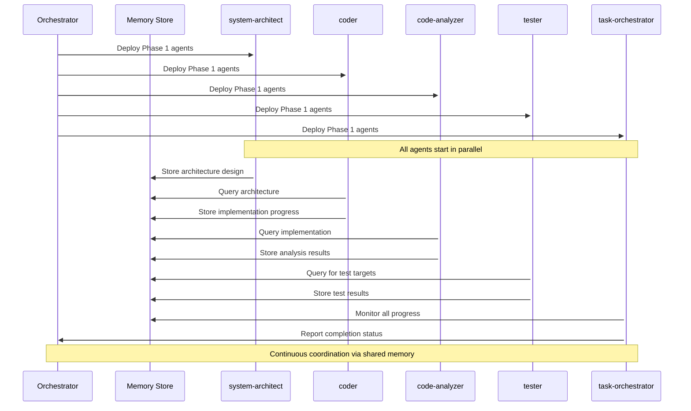

# Modbus BMS Simulator Implementation Phases & Claude-Flow Agent Workflow

## Overview

This diagram shows the implementation phases for the Modbus BMS Simulator using claude-flow agents working in parallel.

## Phase 1: Virtual COM Port + Exact Modbus Protocol

```mermaid
graph TB
    subgraph "Phase 1: Foundation (Week 1)"
        P1["🎯 Phase 1 Start"] --> INIT["Initialize Swarm"]
        
        INIT --> |Parallel Deployment| AGENTS1{
            "Agent Swarm\n(5 agents)"
        }
        
        AGENTS1 --> ARCH1["🏗️ system-architect\n• Design virtual COM architecture\n• Plan Modbus protocol handler"]
        AGENTS1 --> CODER1["💻 coder\n• Implement COM port creation\n• Build Modbus response handler"]
        AGENTS1 --> ANALYZER1["🔍 code-analyzer\n• Analyze register mapping\n• Verify protocol compatibility"]
        AGENTS1 --> TESTER1["🧪 tester\n• Create protocol unit tests\n• Test COM port connectivity"]
        AGENTS1 --> COORD1["📋 task-orchestrator\n• Coordinate agent tasks\n• Track progress & dependencies"]
        
        ARCH1 --> |Memory Store| MEM1[("🧠 Shared Memory\n• Architecture decisions\n• Protocol specifications")]
        CODER1 --> |Memory Store| MEM1
        ANALYZER1 --> |Memory Store| MEM1
        TESTER1 --> |Memory Store| MEM1
        COORD1 --> |Memory Store| MEM1
        
        MEM1 --> P1OUT["✅ Phase 1 Complete\n• Virtual COM port working\n• Basic Modbus responses\n• Register mapping imported"]
    end
    
    subgraph "Phase 2: Complete BMS Simulation (Week 2)"
        P1OUT --> P2["🎯 Phase 2 Start"]
        P2 --> AGENTS2{"Agent Swarm\n(6 agents)"}
        
        AGENTS2 --> ARCH2["🏗️ system-architect\n• Design BMS physics model\n• Plan data simulation"]
        AGENTS2 --> CODER2A["💻 coder-1\n• Implement cell voltage sim\n• Build pack calculations"]
        AGENTS2 --> CODER2B["💻 coder-2\n• Create temperature sim\n• Implement current flows"]
        AGENTS2 --> ANALYZER2["🔍 code-analyzer\n• Validate BMS physics\n• Check data realism"]
        AGENTS2 --> TESTER2["🧪 tester\n• Test all 36 registers\n• Validate data ranges"]
        AGENTS2 --> COORD2["📋 task-orchestrator\n• Manage parallel dev\n• Sync agent work"]
        
        subgraph "BMS Components"
            CELLS["8S Cell Voltages\n(3.2-3.4V each)"]
            PACK["Pack Voltage\n(25.6-27.2V)"]
            TEMPS["Temperature Sensors\n(20-35°C)"]
            CURRENT["Current Flow\n(-10A to +5A)"]
            FG["Fuel Gauge Data\n(SOC, capacity, etc)"]
        end
        
        CODER2A --> CELLS
        CODER2A --> PACK
        CODER2B --> TEMPS
        CODER2B --> CURRENT
        CODER2B --> FG
        
        CELLS --> P2OUT["✅ Phase 2 Complete\n• All registers simulated\n• Realistic BMS behavior\n• Physics-based model"]
        PACK --> P2OUT
        TEMPS --> P2OUT
        CURRENT --> P2OUT
        FG --> P2OUT
    end
    
    subgraph "Phase 3: Rich CLI Interface (Week 3)"
        P2OUT --> P3["🎯 Phase 3 Start"]
        P3 --> AGENTS3{"Agent Swarm\n(5 agents)"}
        
        AGENTS3 --> ARCH3["🏗️ system-architect\n• Design CLI architecture\n• Plan UI components"]
        AGENTS3 --> CODER3["💻 coder\n• Build Rich CLI dashboard\n• Implement controls"]
        AGENTS3 --> UX["🎨 base-template-generator\n• Create UI templates\n• Design user flows"]
        AGENTS3 --> TESTER3["🧪 tester\n• Test UI interactions\n• Validate displays"]
        AGENTS3 --> COORD3["📋 task-orchestrator\n• Coordinate UI dev\n• Manage integration"]
        
        subgraph "CLI Features"
            DASH["Real-time Dashboard\n• All register values\n• Live updates"]
            CTRL["Interactive Controls\n• Scenario selection\n• Parameter adjustment"]
            MON["Modbus Monitor\n• Communication logs\n• Protocol debugging"]
            LOG["Data Logging\n• CSV output\n• Historical tracking"]
        end
        
        CODER3 --> DASH
        CODER3 --> CTRL
        CODER3 --> MON
        CODER3 --> LOG
        
        DASH --> P3OUT["✅ Phase 3 Complete\n• Rich CLI interface\n• Real-time monitoring\n• Full user control"]
        CTRL --> P3OUT
        MON --> P3OUT
        LOG --> P3OUT
    end
    
    subgraph "Phase 4: Scenario System (Week 4)"
        P3OUT --> P4["🎯 Phase 4 Start"]
        P4 --> AGENTS4{"Agent Swarm\n(7 agents)"}
        
        AGENTS4 --> SCENARIOS["Scenario Agents"]
        
        SCENARIOS --> S1["🔋 Normal Operation\nAgent"]
        SCENARIOS --> S2["⚡ Charging\nAgent"]
        SCENARIOS --> S3["📉 Discharging\nAgent"]
        SCENARIOS --> S4["⚠️ Fault Injection\nAgent"]
        SCENARIOS --> S5["📊 Data Playback\nAgent"]
        SCENARIOS --> S6["⚙️ Config Manager\nAgent"]
        SCENARIOS --> S7["📋 Coordinator\nAgent"]
        
        S1 --> P4OUT["✅ Phase 4 Complete\n• All scenarios working\n• Config file support\n• Fault simulation"]
        S2 --> P4OUT
        S3 --> P4OUT
        S4 --> P4OUT
        S5 --> P4OUT
        S6 --> P4OUT
    end
    
    subgraph "Phase 5: Testing & Integration (Week 5)"
        P4OUT --> P5["🎯 Phase 5 Start"]
        P5 --> AGENTS5{"Agent Swarm\n(8 agents)"}
        
        AGENTS5 --> TEST["Testing Agents"]
        
        TEST --> T1["🧪 Integration Tester\n• End-to-end tests\n• Logger compatibility"]
        TEST --> T2["📊 Performance Analyzer\n• Benchmark tests\n• Optimization"]
        TEST --> T3["🖥️ Cross-platform Tester\n• Windows/Linux/Mac\n• COM port variants"]
        TEST --> T4["📝 Documentation Agent\n• User guides\n• API docs"]
        TEST --> T5["🔍 Code Reviewer\n• Code quality\n• Best practices"]
        TEST --> T6["📦 Release Manager\n• Package builds\n• Distribution"]
        TEST --> T7["🐛 Bug Hunter\n• Edge cases\n• Error scenarios"]
        TEST --> T8["📋 QA Coordinator\n• Test coverage\n• Sign-off"]
        
        T1 --> FINAL["🎉 Project Complete\n• Fully tested simulator\n• Production ready\n• 100% GA app compatible"]
        T2 --> FINAL
        T3 --> FINAL
        T4 --> FINAL
        T5 --> FINAL
        T6 --> FINAL
        T7 --> FINAL
        T8 --> FINAL
    end
    
    style P1 fill:#f9f,stroke:#333,stroke-width:4px
    style P2 fill:#f9f,stroke:#333,stroke-width:4px
    style P3 fill:#f9f,stroke:#333,stroke-width:4px
    style P4 fill:#f9f,stroke:#333,stroke-width:4px
    style P5 fill:#f9f,stroke:#333,stroke-width:4px
    style FINAL fill:#9f9,stroke:#333,stroke-width:4px
```

## Agent Coordination Pattern



## Key Implementation Details

### Virtual COM Port Setup
- **Windows**: Use com0com for virtual serial port pairs
- **Linux/Mac**: Use socat for virtual serial port creation
- **Port Configuration**: 9600 baud, 8N1, RTU mode

### Modbus Protocol Implementation
- **Function Code**: 0x04 (Read Input Registers)
- **Start Address**: 9 (data starts at register 10)
- **Register Count**: 36 (registers 10-45)
- **Slave ID**: 1 (default)

### Register Mapping (Critical)
```python
# Exact mapping from GA app
register_map = {
    10: "afe_cell_volt1",         # 3200-3400 mV
    11: "afe_cell_volt2",         # 3200-3400 mV
    12: "afe_cell_volt3",         # 3200-3400 mV
    13: "afe_cell_volt4",         # 3200-3400 mV
    14: "afe_cell_volt5",         # 3200-3400 mV
    15: "afe_cell_volt6",         # 3200-3400 mV
    16: "afe_cell_volt7",         # 3200-3400 mV
    17: "afe_cell_volt8",         # 3200-3400 mV
    18: "afe_pack_volt",          # 25600-27200 mV
    19: "afe_cell_volt_delta",    # 0-50 mV
    20: "afe_temp1",              # 200-350 (20-35°C)
    21: "afe_temp2",              # 200-350 (20-35°C)
    22: "afe_current",            # -10000 to +5000 mA
    # ... continues to register 45
}
```

### CSV Output Format
```
Timestamp,afe_cell_volt1,afe_cell_volt2,...,fg_lifetime_max_dsg
2025-08-02 10:15:30,3285,3287,3283,...,45000
```

## Confidence Assessment Factors

✅ **High Confidence Factors**:
- Clear register mapping from source code
- Exact Modbus protocol details available
- CSV format fully documented
- Standalone logger code as reference

⚠️ **Risk Factors**:
- Virtual COM port setup varies by OS
- Moving average filter algorithm needs extraction
- Real-time performance requirements
- Cross-platform compatibility testing

## Agent Resource Requirements

| Agent Type | Count | Primary Tools | Memory Usage |
|------------|-------|---------------|-------------|
| system-architect | 2 | Design, Planning | Low |
| coder | 4 | Implementation | Medium |
| code-analyzer | 2 | Analysis, Validation | Medium |
| tester | 3 | Testing, Validation | High |
| task-orchestrator | 1 | Coordination | Low |
| base-template-generator | 1 | UI Templates | Low |
| perf-analyzer | 1 | Performance | High |
| reviewer | 1 | Code Review | Medium |

**Total Agents**: 15 across all phases
**Peak Concurrent**: 8 agents (Phase 5)
**Memory Requirement**: ~2GB for full swarm
