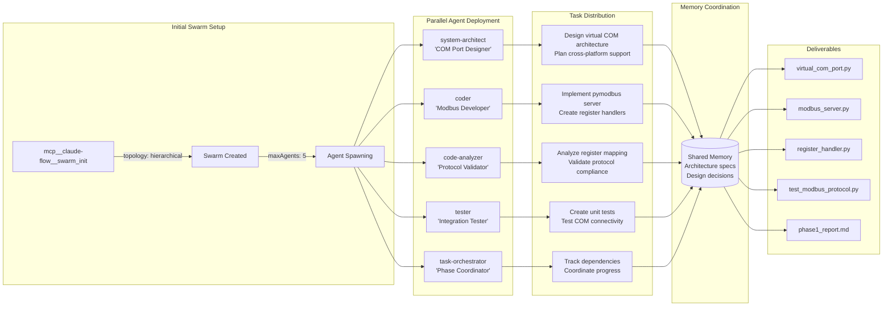
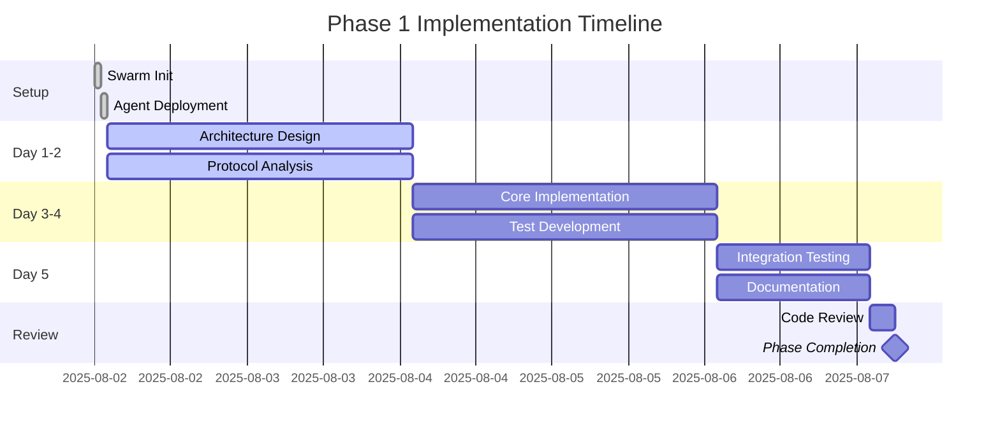

# Phase 1 Dry-Run Execution Plan

## Objective
Implement Virtual COM Port + Exact Modbus Protocol handler in Week 1

## Claude-Flow Agent Deployment Strategy



## Detailed Task Breakdown

### 1. System Architect Agent Tasks

```yaml
Agent: system-architect
Name: "COM Port Designer"
Tasks:
  - Analyze virtual COM port options:
    - Windows: com0com implementation
    - Linux/Mac: socat implementation
  - Design abstraction layer for cross-platform support
  - Define Modbus server architecture
  - Create interface specifications
  - Document design decisions in memory

Deliverables:
  - architecture_design.md
  - com_port_interface.py (interface definition)
  - platform_config.yaml
```

### 2. Coder Agent Tasks

```yaml
Agent: coder
Name: "Modbus Developer"
Tasks:
  - Implement ModbusSimulatorServer class
  - Create register mapping importer
  - Build read_input_registers handler
  - Implement COM port initialization
  - Add basic register value generation

Deliverables:
  - modbus_server.py
  - register_handler.py
  - com_port_manager.py
  - config_loader.py
```

### 3. Code Analyzer Agent Tasks

```yaml
Agent: code-analyzer  
Name: "Protocol Validator"
Tasks:
  - Extract exact register mapping from modbus_query_test.py
  - Validate Modbus protocol implementation
  - Ensure address offset handling (9 vs 10)
  - Verify data type conversions
  - Check compatibility with standalone logger

Deliverables:
  - protocol_validation_report.md
  - register_mapping_verified.json
  - compatibility_checklist.md
```

### 4. Tester Agent Tasks

```yaml
Agent: tester
Name: "Integration Tester"
Tasks:
  - Create unit tests for Modbus server
  - Test virtual COM port creation
  - Validate register read operations
  - Test with mock Modbus client
  - Create integration test suite

Deliverables:
  - test_modbus_server.py
  - test_com_port.py
  - test_register_handler.py
  - test_integration.py
```

### 5. Task Orchestrator Agent Tasks

```yaml
Agent: task-orchestrator
Name: "Phase Coordinator"
Tasks:
  - Initialize shared memory store
  - Track task dependencies
  - Monitor agent progress
  - Coordinate inter-agent communication
  - Generate phase completion report

Deliverables:
  - phase1_progress.json
  - dependency_graph.md
  - completion_report.md
```

## Implementation Timeline



## Key Implementation Files

### 1. modbus_server.py (Core Server)

```python
#!/usr/bin/env python3
"""
Modbus BMS Simulator Server
Implements exact GA app compatible Modbus RTU server
"""

import sys
from pathlib import Path
sys.path.insert(0, str(Path(__file__).parent.parent))

from pymodbus.server import ModbusSerialServer
from pymodbus.datastore import ModbusSlaveContext, ModbusServerContext
from pymodbus.datastore import ModbusSequentialDataBlock

# Import exact register mapping
from src.modbus_query_test import register_map

class ModbusSimulatorServer:
    def __init__(self, port: str, slave_id: int = 1):
        self.port = port
        self.slave_id = slave_id
        self.register_map = register_map
        self.num_registers = len(register_map)
        
        # Initialize data store
        self.store = ModbusSlaveContext(
            ir=ModbusSequentialDataBlock(9, [0] * (self.num_registers + 1))
        )
        
        self.context = ModbusServerContext(
            slaves={self.slave_id: self.store}, 
            single=False
        )
        
    def start(self):
        """Start Modbus RTU server"""
        self.server = ModbusSerialServer(
            context=self.context,
            framer=ModbusRtuFramer,
            port=self.port,
            baudrate=9600,
            stopbits=1,
            bytesize=8,
            parity='N'
        )
        self.server.serve_forever()
```

### 2. register_handler.py (Register Management)

```python
class RegisterHandler:
    """Handles register value generation and updates"""
    
    def __init__(self, register_map: dict):
        self.register_map = register_map
        self.values = {addr: 0 for addr in register_map.keys()}
        
    def update_register(self, address: int, value: int):
        """Update single register value"""
        if address in self.register_map:
            self.values[address] = value
            
    def get_register_values(self, start_addr: int = 10, count: int = 36):
        """Get register values for Modbus response"""
        values = []
        for i in range(count):
            addr = start_addr + i
            values.append(self.values.get(addr, 0))
        return values
```

### 3. Virtual COM Port Setup Scripts

#### Windows (setup_com_windows.bat)
```batch
@echo off
echo Setting up virtual COM ports for Windows...
echo Please install com0com from: https://sourceforge.net/projects/com0com/
echo Then use com0com setup to create COM10 <-> COM11 pair
pause
```

#### Linux/Mac (setup_com_unix.sh)
```bash
#!/bin/bash
echo "Setting up virtual serial ports..."

# Create virtual serial port pair
socat -d -d pty,raw,echo=0,link=/tmp/modbus_sim pty,raw,echo=0,link=/tmp/modbus_client &
SOCAT_PID=$!

echo "Virtual ports created:"
echo "  Simulator: /tmp/modbus_sim"
echo "  Client: /tmp/modbus_client"
echo "Socat PID: $SOCAT_PID"
```

## Success Criteria for Phase 1

✅ **Must Have**:
- [ ] Virtual COM port working on at least one platform
- [ ] Modbus server responds to read_input_registers(9, 36, 1)
- [ ] Register mapping imported from GA app
- [ ] Basic register values returned (can be zeros)
- [ ] Unit tests passing

📊 **Nice to Have**:
- [ ] Cross-platform COM port support
- [ ] Basic logging implemented
- [ ] Configuration file support started
- [ ] Performance benchmarks

## Risk Mitigation

| Risk | Impact | Mitigation |
|------|--------|------------|
| COM port setup complexity | High | Provide detailed platform-specific guides |
| Modbus library issues | Medium | Have pymodbus fallback implementation |
| Register offset confusion | High | Clear documentation and validation |
| Cross-platform differences | Medium | Abstract platform-specific code |

## Memory Coordination Points

```python
# Key memory entries for agent coordination
memory_keys = {
    "architecture/com_port_design": "Platform abstraction design",
    "architecture/modbus_server": "Server architecture decisions",
    "implementation/register_mapping": "Verified register map",
    "implementation/protocol_details": "Modbus protocol specifics",
    "testing/test_results": "Unit test outcomes",
    "progress/phase1_status": "Overall phase completion"
}
```

## Phase 1 Completion Checklist

- [ ] All 5 agents successfully deployed
- [ ] Virtual COM port creation documented
- [ ] Modbus server responding correctly
- [ ] Register mapping verified against GA app
- [ ] Unit tests written and passing
- [ ] Integration test with mock client successful
- [ ] Documentation complete
- [ ] Code reviewed and approved
- [ ] Phase 1 report generated

---

**Note**: This is a dry-run plan. Actual implementation will begin upon approval.