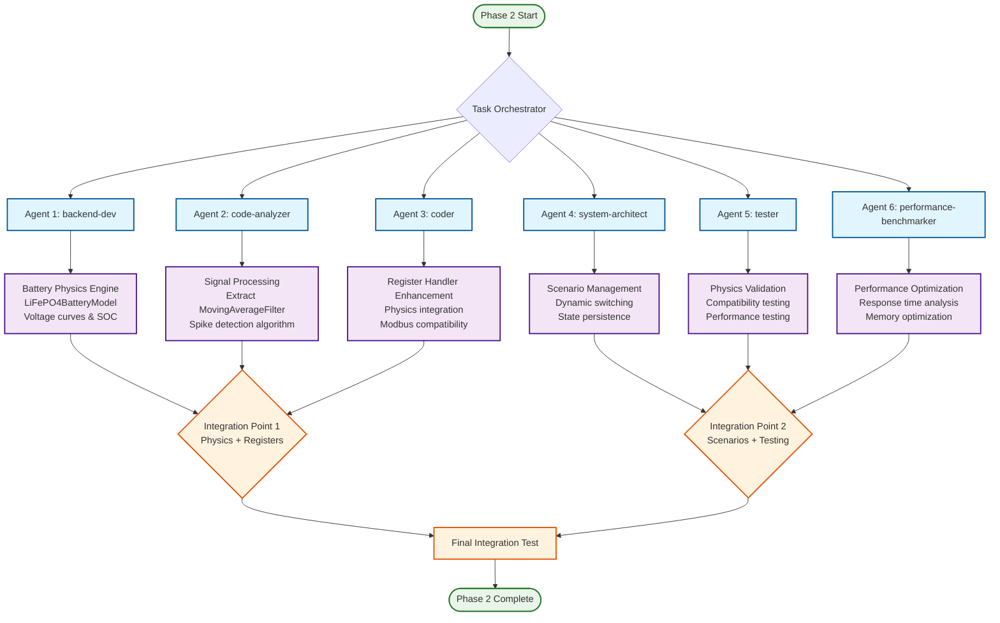
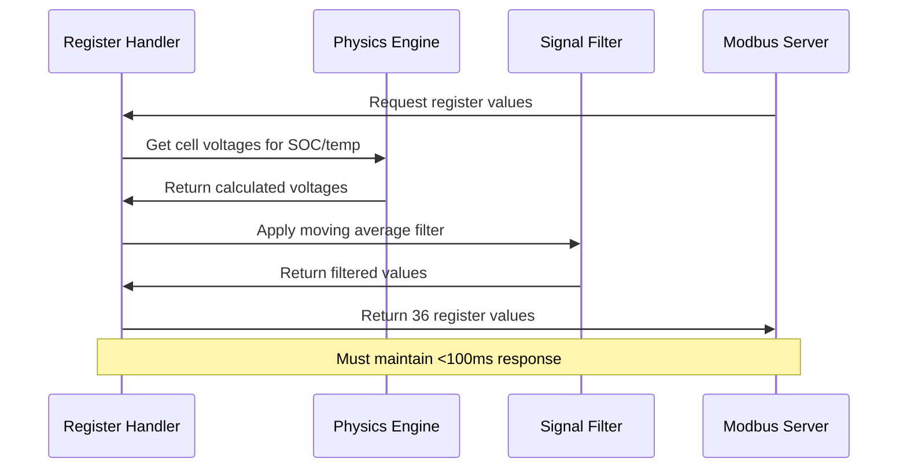
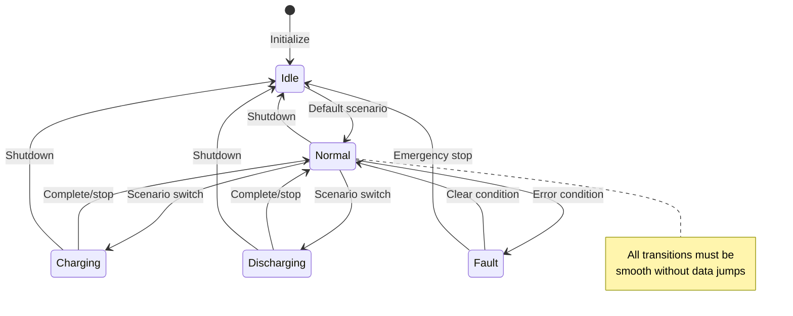

# 🤖 Phase 2 Sub-Agent Workflow Diagram

## 📊 **Agent Deployment Strategy**

## 🎯 **Agent Responsibilities Matrix**

| Agent | Primary Task | Key Deliverables | Dependencies | Duration |
|-------|-------------|------------------|--------------|----------|
| **backend-dev** | Battery Physics Engine | `battery_physics.py` `LiFePO4BatteryModel` class Voltage calculation algorithms | LiFePO4 research data | Week 1 |
| **code-analyzer** | Signal Processing | `signal_processing.py` `MovingAverageFilter` class Algorithm extraction | `modbus_standalone_logger.py` | Week 1 |
| **coder** | Register Enhancement | Enhanced `register_handler.py` Physics integration Backward compatibility | Physics engine + filters | Week 2 |
| **system-architect** | Scenario Management | `scenario_manager.py` Configuration system State management | Requirements analysis | Week 2 |
| **tester** | Validation & Testing | Test suites Physics validation Compatibility tests | All components | Week 2-3 |
| **performance-benchmarker** | Optimization | Performance analysis Memory optimization Response time tuning | Working implementation | Week 3 |

## 🔄 **Parallel Execution Flow**

### **Phase 1: Foundation (Week 1)**

```mermaid
gantt
    title Phase 2 - Week 1 Implementation
    dateFormat X
    axisFormat %d
    
    section Battery Physics
    LiFePO4 Research     :research, 0, 2d
    Physics Model        :physics, after research, 3d
    Voltage Algorithms   :voltage, after physics, 2d
    
    section Signal Processing  
    Algorithm Analysis   :analysis, 0, 2d
    Filter Implementation :filter, after analysis, 3d
    Validation Tests     :test-filter, after filter, 2d
    
    section Coordination
    Interface Design     :interface, 0, 3d
    Integration Planning :plan, after interface, 2d
```

### **Phase 2: Integration (Week 2)**

```mermaid
gantt
    title Phase 2 - Week 2 Integration
    dateFormat X
    axisFormat %d
    
    section Register Enhancement
    Physics Integration  :reg-physics, 0, 3d
    Compatibility Testing :reg-test, after reg-physics, 2d
    
    section Scenario System
    Scenario Design      :scenario, 0, 2d
    State Management     :state, after scenario, 3d
    Configuration System :config, after state, 2d
    
    section Validation
    Component Testing    :comp-test, 2, 3d
    Integration Testing  :int-test, after comp-test, 2d
```

## ⚡ **Critical Integration Points**

### **Integration Point 1: Physics + Registers**

### **Integration Point 2: Scenarios + State**

## 🔧 **Agent Coordination Protocol**

### **Communication Structure**
1. **Daily Standup**: Each agent reports progress and blockers
2. **Integration Checkpoints**: Weekly coordination for interface compatibility
3. **Shared Documentation**: All agents update shared architecture docs
4. **Cross-Validation**: Agents test each other's components

### **Conflict Resolution**
- **Interface Conflicts**: `system-architect` arbitrates design decisions
- **Performance Issues**: `performance-benchmarker` provides optimization guidance
- **Test Failures**: `tester` coordinates with relevant agent for fixes
- **Integration Problems**: `coder` handles cross-component integration

### **Quality Gates**
Each agent must pass these checkpoints:
- ✅ **Code Review**: `reviewer` validates implementation
- ✅ **Unit Tests**: Agent creates comprehensive test coverage
- ✅ **Integration Test**: Component works with existing Phase 1 code
- ✅ **Performance Test**: Meets response time requirements

## 📈 **Success Metrics**

### **Individual Agent Success**
- **backend-dev**: Cell voltages within ±50mV of real LiFePO4
- **code-analyzer**: Filter produces identical results to standalone logger
- **coder**: 100% backward compatibility maintained
- **system-architect**: Smooth scenario transitions achieved
- **tester**: All tests pass with >95% coverage
- **performance-benchmarker**: <100ms response time maintained

### **Team Success**
- ✅ All 36 registers provide realistic, correlated values
- ✅ Moving average filter exactly matches standalone logger
- ✅ Scenario switching works seamlessly
- ✅ No performance degradation from Phase 1
- ✅ Complete documentation and test coverage

## 🚨 **Risk Mitigation**

### **Agent Dependencies**
- **Physics accuracy risk**: `backend-dev` validates against published LiFePO4 data
- **Algorithm extraction risk**: `code-analyzer` creates reference tests against standalone logger
- **Integration complexity**: `coder` implements incremental integration with rollback capability
- **Performance degradation**: `performance-benchmarker` establishes baseline early

### **Coordination Risks**
- **Interface mismatches**: Regular integration checkpoints
- **Timeline delays**: Parallel development with flexible handoff points
- **Quality issues**: Continuous testing and validation
- **Communication gaps**: Shared documentation and daily updates

---

**This workflow ensures efficient parallel development while maintaining integration compatibility and meeting all Phase 2 objectives.**