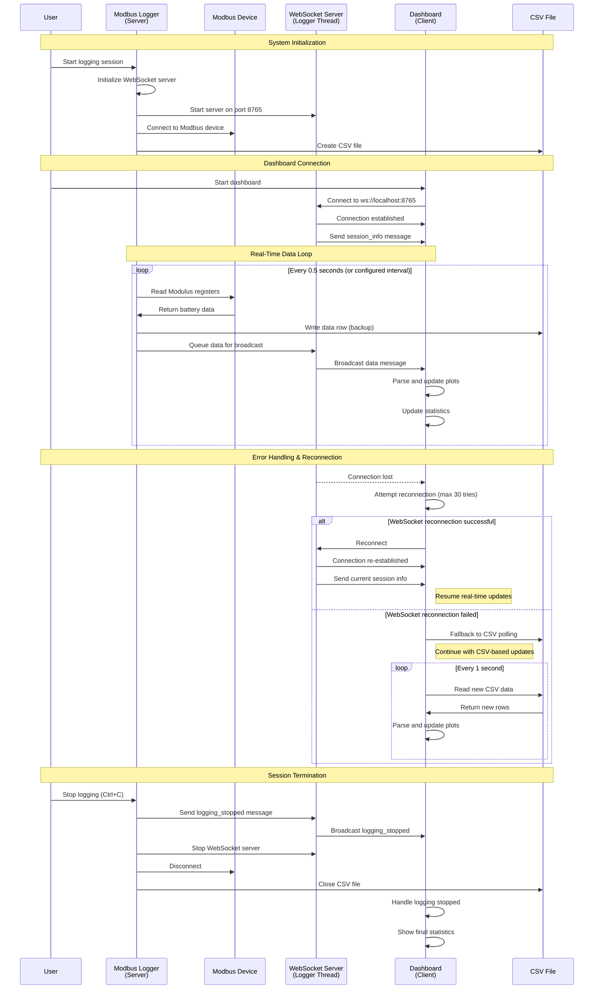
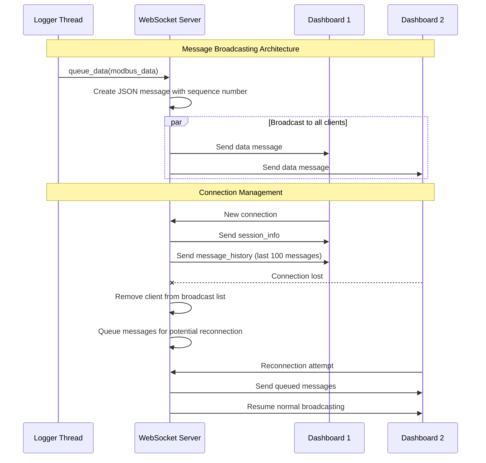
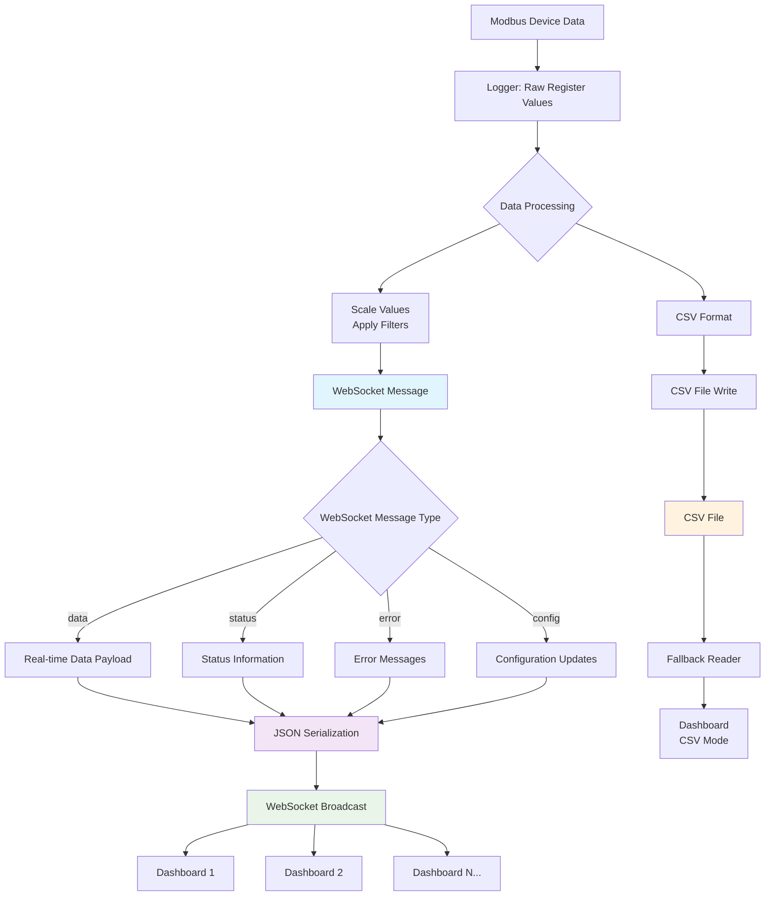
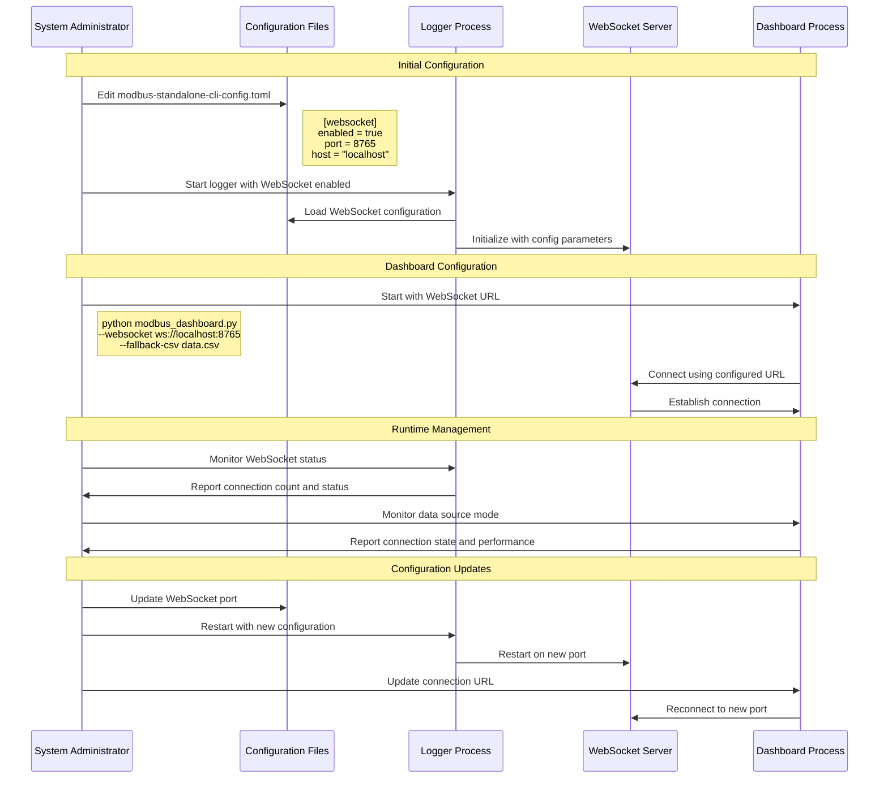
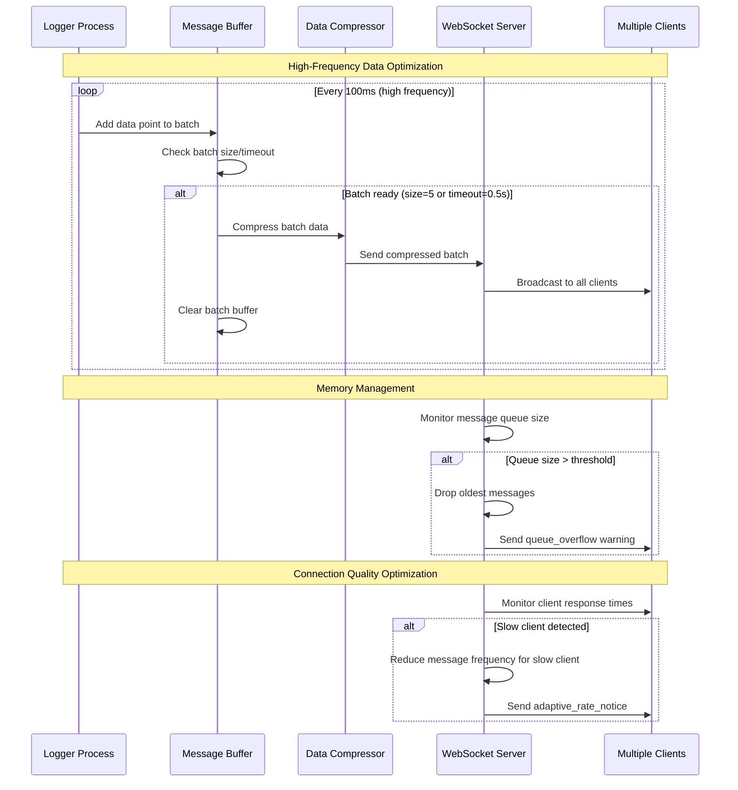

# WebSocket Integration Sequence Diagram

## Real-Time Data Flow with WebSocket Communication



## WebSocket Message Flow Detail



## Error Handling and Fallback Sequence

```mermaid
sequenceDiagram
    participant Dashboard
    participant WSConnection as WebSocket Connection
    participant CSVFallback as CSV File Reader
    participant UIDisplay as Dashboard UI

    Note over Dashboard, UIDisplay: Normal WebSocket Operation

    Dashboard->>WSConnection: Maintain connection
    WSConnection->>Dashboard: Receive real-time data
    Dashboard->>UIDisplay: Update plots (real-time)

    Note over Dashboard, UIDisplay: Connection Failure Detection

    WSConnection--xDashboard: Connection timeout/error
    Dashboard->>Dashboard: Start reconnection timer
    Dashboard->>UIDisplay: Show "Attempting reconnection..."

    Note over Dashboard, UIDisplay: Reconnection Attempts

    loop Reconnection attempts (max 30)
        Dashboard->>WSConnection: Attempt reconnection
        alt Connection successful
            WSConnection->>Dashboard: Connection restored
            Dashboard->>UIDisplay: Show "Connected via WebSocket"
            break Resume normal operation
        else Connection failed
            Dashboard->>Dashboard: Wait 2 seconds (exponential backoff)
            Dashboard->>UIDisplay: Update retry counter
        end
    end

    Note over Dashboard, UIDisplay: Fallback to CSV Mode

    Dashboard->>CSVFallback: Initialize CSV file reader
    Dashboard->>UIDisplay: Show "Using CSV fallback mode"
    
    loop CSV polling mode
        Dashboard->>CSVFallback: Poll for new data
        CSVFallback->>Dashboard: Return new CSV rows
        Dashboard->>UIDisplay: Update plots (slower refresh)
        Dashboard->>Dashboard: Wait 1 second
    end

    Note over Dashboard, UIDisplay: Optional WebSocket Recovery

    Dashboard->>WSConnection: Periodic reconnection check
    alt WebSocket available again
        WSConnection->>Dashboard: Connection successful
        Dashboard->>CSVFallback: Stop CSV polling
        Dashboard->>UIDisplay: Show "Reconnected to WebSocket"
    end
```

## Data Message Structure Flow



## Configuration and Deployment Sequence



## Performance Optimization Sequence



This sequence diagram illustrates the complete WebSocket integration workflow, including:

1. **System initialization** with WebSocket server setup
2. **Real-time data flow** from Modbus device through WebSocket to dashboard
3. **Error handling and fallback** to CSV mode when WebSocket fails
4. **Message broadcasting** to multiple clients
5. **Configuration management** and deployment procedures
6. **Performance optimization** strategies for high-frequency data

The diagram shows how the WebSocket integration maintains backward compatibility while providing enhanced real-time performance and multi-client support.