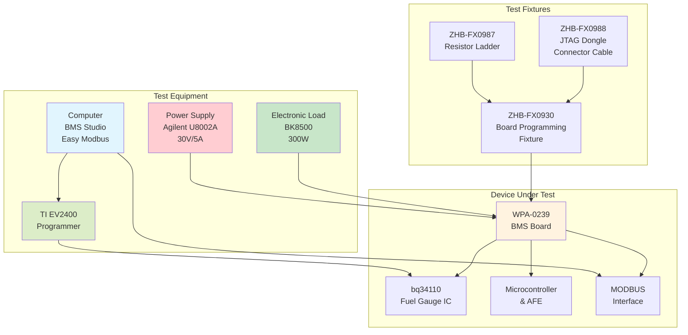
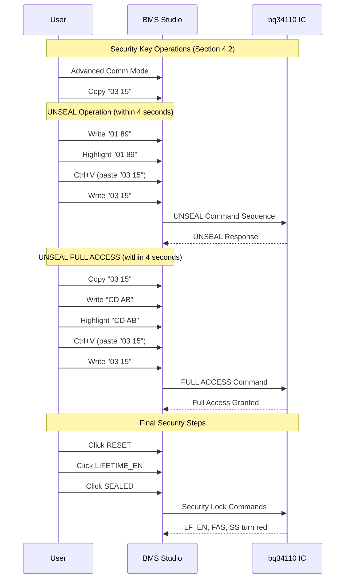
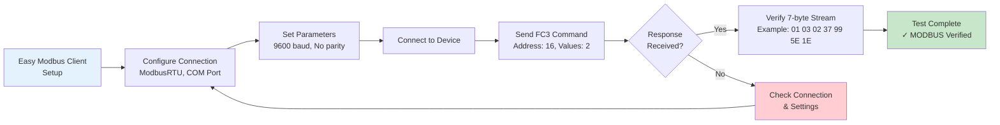
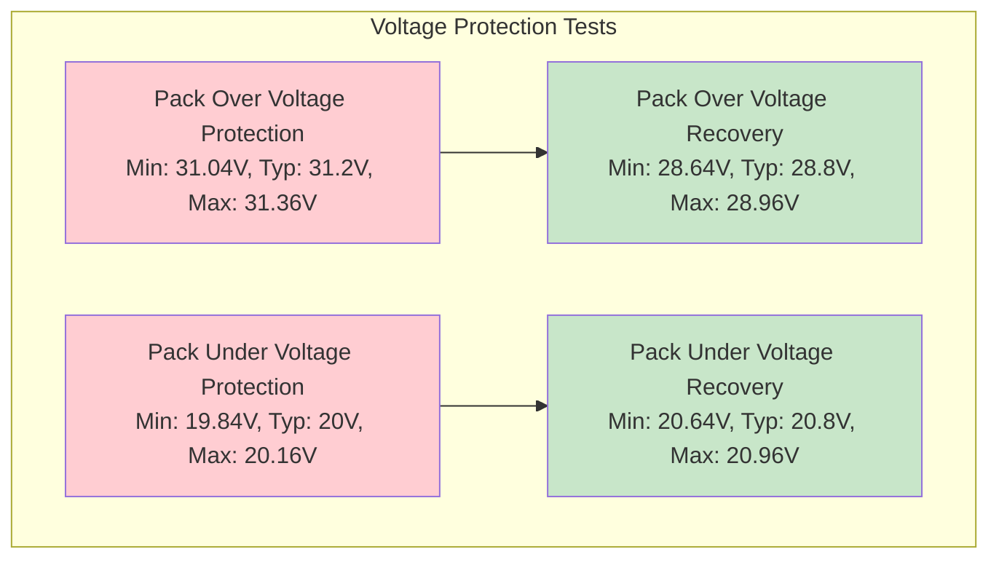

# MTI-102284-04 BMS Test Instruction Workflow

## Document Overview
- **Document Number**: MTI-102284-04
- **Title**: Test Instruction for WPA-0239 BMS Programming and Testing
- **Company**: Custom Power
- **Current Revision**: B

## Complete Test Workflow Diagram

```mermaid
flowchart TD
    A[Start: MTI-102284-04<br/>BMS Test Instruction] --> B[Equipment Setup<br/>Section 2]
    
    B --> B1[Power Supply: Agilent U8002A<br/>30V/5A, ID#156]
    B --> B2[Electronic Load: BK8500<br/>300W, ID#353]
    B --> B3[TI EV2400 Programmer<br/>Interface Module]
    B --> B4[Computer with BMS Studio<br/>& Easy Modbus Client]
    B --> B5[Test Fixtures<br/>ZHB-FX0930, ZHB-FX0987]
    
    B1 --> C[Section 3: bq34110 Programming]
    B2 --> C
    B3 --> C
    B4 --> C
    B5 --> C
    
    C --> C1[Set Power Supply<br/>28.4V, 0.5A]
    C1 --> C2[Connect Fixtures<br/>& Cables]
    C2 --> C3[Run Battery Management<br/>Studio 1.3.111]
    C3 --> C4[Load WPA-0239_xxx.ds.fs<br/>Program File]
    C4 --> C5[Program bq34110<br/>Press Program & Reset]
    C5 --> C6[Verify Configuration<br/>8600,0110,8]
    
    C6 --> D[Section 4: Calibration & Testing]
    
    D --> D1[Adjust Power Supply<br/>28.4V, 3A]
    D1 --> D2[Voltage Calibration<br/>Measure & Enter Bat+/Bat-]
    D2 --> D3[CC Offset & Board<br/>Offset Calibration]
    D3 --> D4[Temperature<br/>Calibration]
    D4 --> D5[Current Calibration<br/>Connect 2A Load]
    D5 --> D6[Verify -1000mA<br/>Current Reading]
    D6 --> D7[Serial Number Entry<br/>Block A 15,16,17,18]
    D7 --> D8[Write S/N on PCB<br/>Top-Right]
    D8 --> D9[Verify CC_Gain &<br/>CC Delta: 2.0-2.3]
    D9 --> D10[Security Operations<br/>RESET, LIFETIME_EN, SEALED]
    
    D10 --> E[Section 5: Microcontroller Programming]
    
    E --> E1[Load ST-Link Program]
    E1 --> E2[Connect to Device<br/>Target -> Connect]
    E2 --> E3[Program AFE Registers<br/>Load WPA-0239_xxx.hex]
    E3 --> E4[Select Options:<br/>Verify, Reset, Checksum]
    E4 --> E5[Start Programming<br/>Verify OK Status]
    
    E5 --> F[Section 6: Electrical Tests]
    
    F --> F1[Move Load+ from<br/>Batt+ to Pack+]
    F1 --> F2[Set Debug Switch<br/>to Open-Circuit]
    F2 --> F3[Wake Switch Test<br/>0V -> Pack Voltage Appears]
    F3 --> F4[Pack Over Voltage<br/>Protection Test]
    F4 --> F5[Pack Under Voltage<br/>Protection Test]
    
    F5 --> G[Section 7: MODBUS Verification]
    
    G --> G1[Set Debug Switch<br/>to uProc]
    G1 --> G2[Connect Modbus USB<br/>to Computer]
    G2 --> G3[Identify COM Port<br/>via Device Manager]
    G3 --> G4[Start Easy Modbus<br/>Client]
    G4 --> G5[Configure Settings:<br/>RTU, Slave ID, 9600 baud]
    G5 --> G6[Test FC3 Command<br/>Address 16, Values 2]
    G6 --> G7[Verify 7-byte<br/>Response Stream]
    
    G7 --> H[Section 8: Final Step]
    H --> H1[Write S/N on PCB<br/>Back Side, Next to REV Box]
    
    H1 --> I[Test Complete<br/>✓ BMS Programmed & Verified]
    
    style A fill:#e1f5fe
    style I fill:#c8e6c9
    style C fill:#fff3e0
    style D fill:#fce4ec
    style E fill:#f3e5f5
    style F fill:#e8f5e8
    style G fill:#fff8e1
    style H fill:#ffebee
```

## Equipment and Tools Relationship Diagram

## Security Operations Flow

## MODBUS Communication Test Flow

## Electrical Test Specifications

