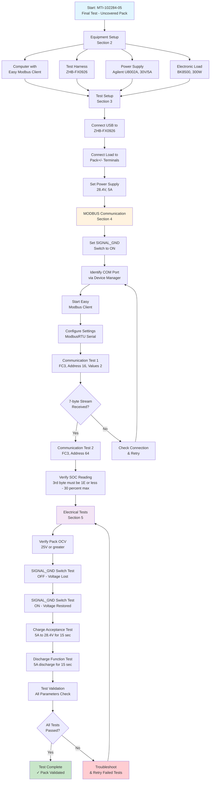
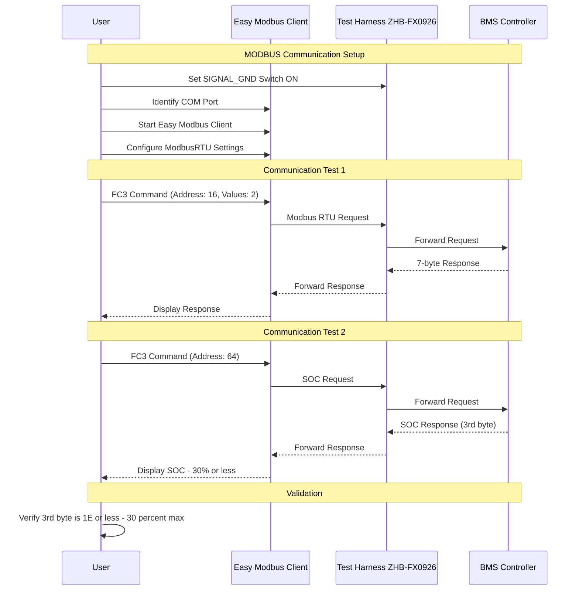
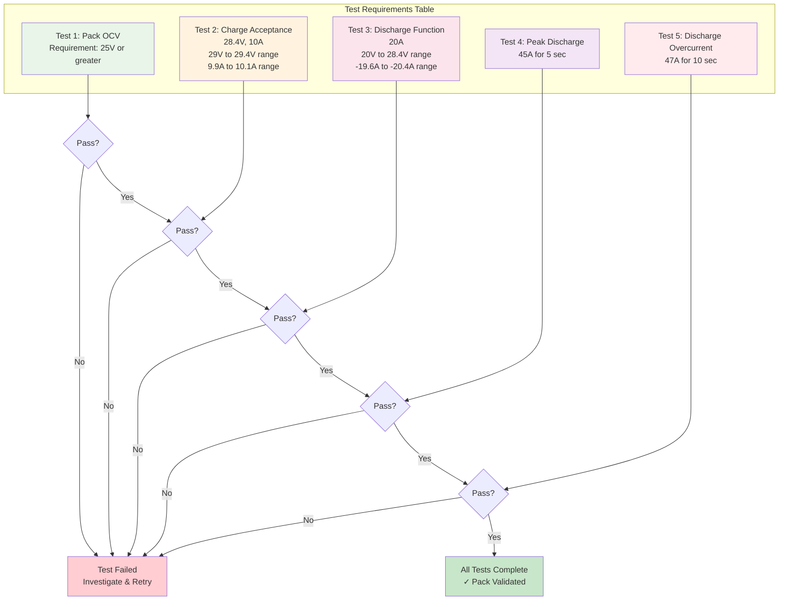
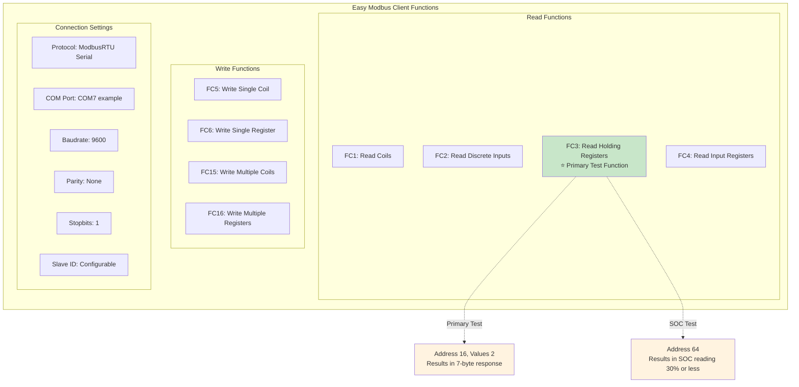
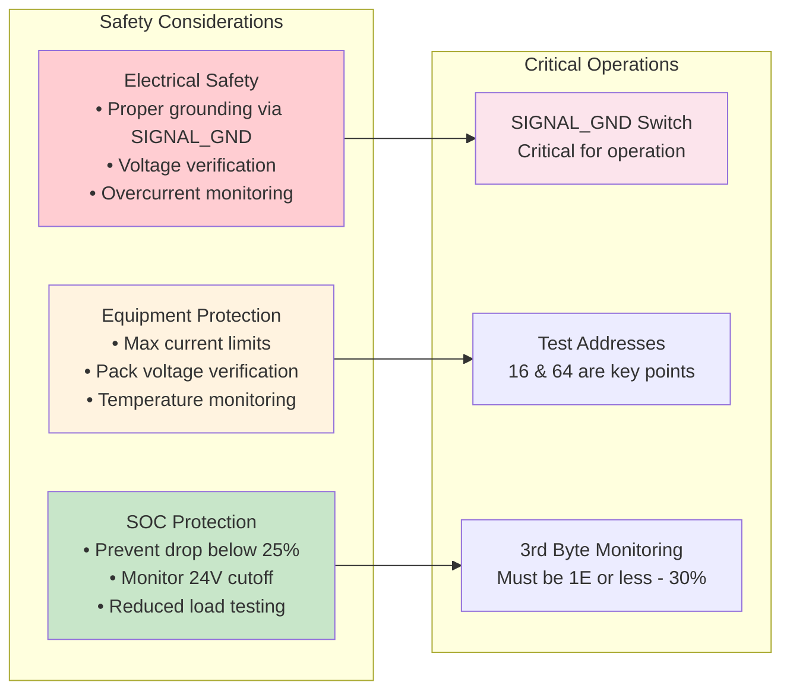

# MTI-102284-05 Final Test with Uncovered Pack

## Document Overview
- **Document Number**: MTI-102284-05
- **Title**: Test Instruction for XGD-JGTFR18650-X72PC
- **Company**: Custom Power
- **Test Type**: Final Test with uncovered Pack

## Complete Test Workflow Diagram



## Equipment Connection Diagram

```mermaid
graph TB
    subgraph "Test Equipment"
        COMP[Computer<br/>Easy Modbus Client]
        PS[Power Supply<br/>Agilent U8002A<br/>30V/5A, ID#156]
        EL[Electronic Load<br/>BK8500<br/>300W, ID#353]
    end
    
    subgraph "Test Interface"
        TH[Test Harness<br/>ZHB-FX0926<br/>RS232 + Pack+/-]
        SGS[SIGNAL_GND<br/>Switch]
    end
    
    subgraph "Device Under Test"
        PACK[XGD-JGTFR18650-X72PC<br/>Battery Pack<br/>Uncovered]
        BMS[BMS Controller<br/>with MODBUS]
        CELLS[Li-ion Cells<br/>18650 Configuration]
    end
    
    COMP -.USB.-> TH
    TH -.RS232.-> BMS
    PS -.28.4V/5A.-> PACK
    EL -.Load.-> TH
    TH -.Pack+/-.-> PACK
    TH --> SGS
    SGS --> BMS
    
    PACK --> BMS
    PACK --> CELLS
    
    style COMP fill:#e3f2fd
    style PS fill:#ffcdd2
    style EL fill:#c8e6c9
    style PACK fill:#fff3e0
    style TH fill:#f3e5f5
```

## MODBUS Communication Test Sequence



## Electrical Test Requirements Matrix



## Easy Modbus Client Interface



## Safety and Protection Features

