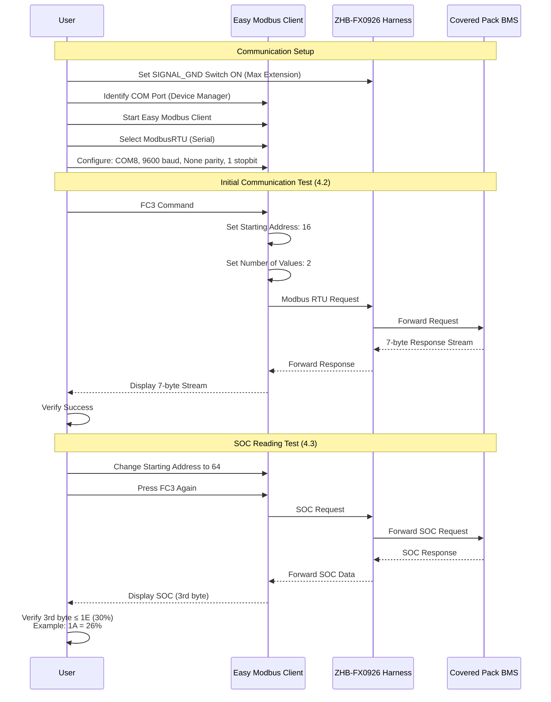
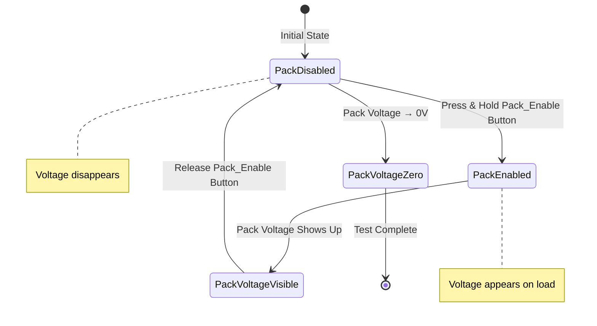
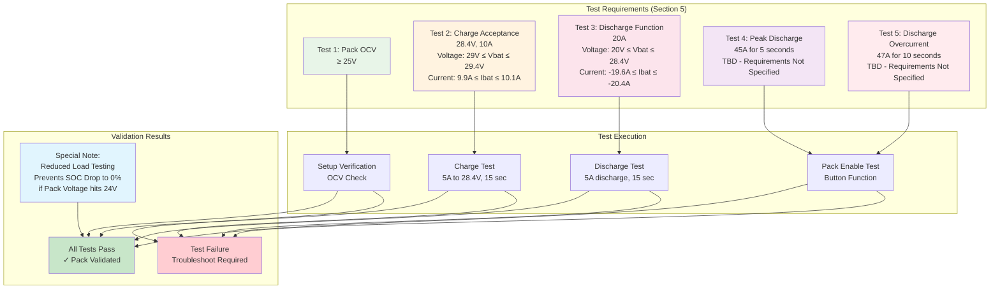
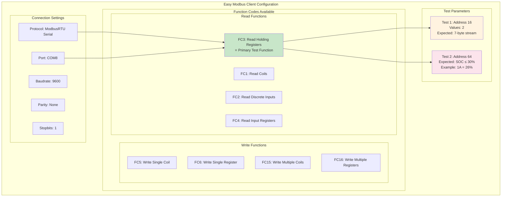
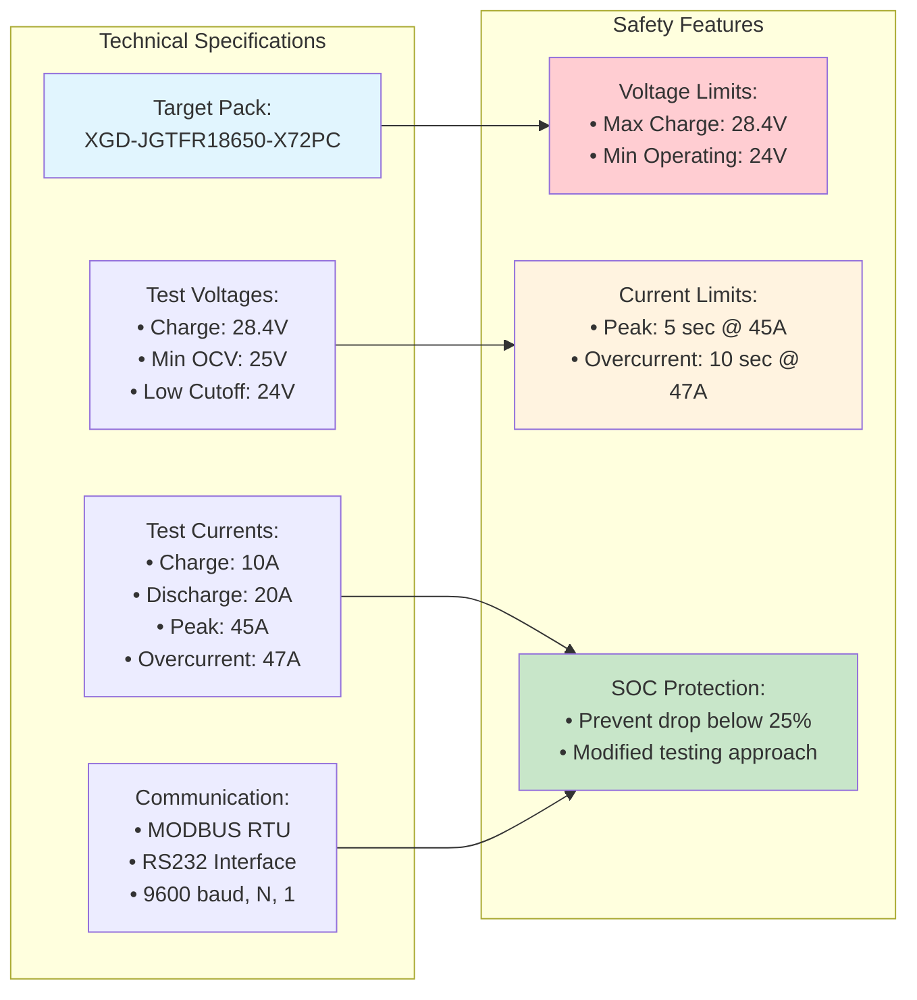
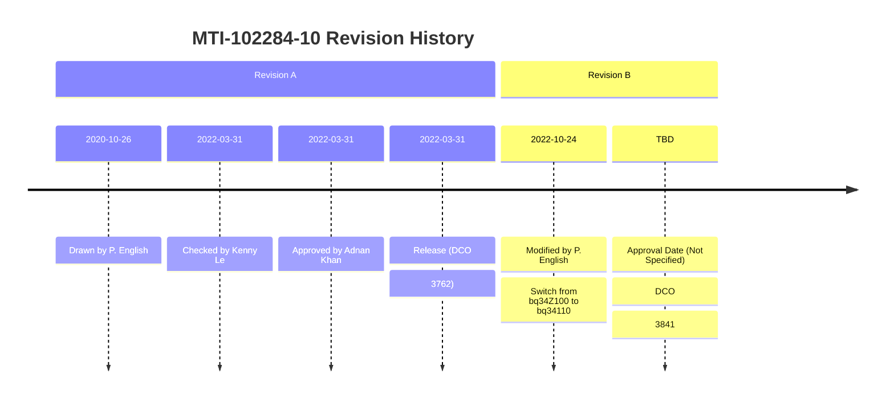

# MTI-102284-10 Final Test with Covered Pack

## Document Overview
- **Document Number**: MTI-102284-10
- **Title**: Test Instruction for XGD-JGTFR18650-X72PC
- **Company**: Custom Power
- **Test Type**: Final Test with covered Pack

## Complete Test Workflow Diagram

```mermaid
flowchart TD
    A[Start: MTI-102284-10<br/>Final Test - Covered Pack] --> B[Equipment Setup<br/>Section 2]
    
    B --> B1[Computer with<br/>Easy Modbus Client]
    B --> B2[Test Harness<br/>ZHB-FX0926]
    B --> B3[Power Supply<br/>Agilent U8002A, 30V/5A]
    B --> B4[Electronic Load<br/>BK8500, 300W]
    
    B1 --> C[Test Setup<br/>Section 3]
    B2 --> C
    B3 --> C
    B4 --> C
    
    C --> C1[Connect USB to<br/>ZHB-FX0926]
    C1 --> C2[Connect Load to<br/>ZHB-FX0926 Pack+/-]
    C2 --> C3[Set Power Supply<br/>28.4V, 5A]
    
    C3 --> D[MODBUS Verification<br/>Section 4]
    
    D --> D1[Set SIGNAL_GND<br/>Switch to ON<br/>Maximum Extension]
    D1 --> D2[Identify COM Port<br/>Device Manager/Ports]
    D2 --> D3[Start Easy<br/>Modbus Client]
    D3 --> D4[Configure Connection<br/>ModbusRTU Serial, COM8]
    D4 --> D5[Initial Test: FC3<br/>Address 16, Values 2]
    D5 --> D6{7-byte Stream<br/>Response OK?}
    D6 -->|Yes| D7[SOC Test: FC3<br/>Address 64]
    D6 -->|No| D8[Check Settings<br/>& Connection]
    D8 --> D4
    D7 --> D9[Verify 3rd Byte<br/>≤ 1E (30%), Example: 1A=26%]
    
    D9 --> E[Electrical Tests<br/>Section 5]
    
    E --> E1[Verify Pack OCV<br/>From Requirements Table]
    E1 --> E2[Pack Enable Function<br/>Press-Hold Pack_Enable Button]
    E2 --> E2A[Pack Voltage Shows Up<br/>Release Button → 0V]
    E2A --> E3[Charge Acceptance<br/>5A to 28.4V for 15 sec]
    E3 --> E4[Discharge Function<br/>5A discharge for 15 sec]
    
    E4 --> F[Test Requirements<br/>Validation]
    
    F --> F1[Test 1: Pack OCV ≥ 25V]
    F --> F2[Test 2: Charge 28.4V/10A<br/>29V ≤ Vbat ≤ 29.4V<br/>9.9A ≤ Ibat ≤ 10.1A]
    F --> F3[Test 3: Discharge 20A<br/>20V ≤ Vbat ≤ 28.4V<br/>-19.6A ≤ Ibat ≤ -20.4A]
    F --> F4[Test 4: Peak Discharge<br/>45A for 5 sec]
    F --> F5[Test 5: Overcurrent<br/>47A for 10 sec]
    
    F1 --> G{All Tests<br/>Pass?}
    F2 --> G
    F3 --> G
    F4 --> G
    F5 --> G
    
    G -->|Yes| H[Test Complete<br/>✓ Covered Pack Validated]
    G -->|No| I[Troubleshoot<br/>& Retest Failed Items]
    I --> E
    
    style A fill:#e1f5fe
    style H fill:#c8e6c9
    style I fill:#ffcdd2
    style D fill:#fff3e0
    style E fill:#f3e5f5
    style F fill:#fce4ec
```

## Equipment and Interface Architecture

```mermaid
graph TB
    subgraph "Test Equipment Layer"
        COMP[Computer<br/>Easy Modbus Client<br/>COM8 Interface]
        PS[Power Supply<br/>Agilent U8002A<br/>30V/5A, ID#156]
        EL[Electronic Load<br/>BK8500<br/>300W, ID#353]
    end
    
    subgraph "Interface Layer"
        TH[Test Harness<br/>ZHB-FX0926<br/>RS232 + Pack+/-]
        SGS[SIGNAL_GND Switch<br/>ON/OFF Control]
        PEB[Pack_Enable Button<br/>Press-Hold Function]
    end
    
    subgraph "Device Under Test"
        subgraph "Covered Pack"
            PACK[XGD-JGTFR18650-X72PC<br/>Battery Pack<br/>(Covered/Enclosed)]
            BMS[BMS Controller<br/>MODBUS Interface]
            PROT[Protection Circuits<br/>Enable/Disable Logic]
        end
    end
    
    COMP -.USB.-> TH
    TH -.RS232.-> BMS
    PS -.Charge 28.4V.-> TH
    EL -.Load Testing.-> TH
    TH -.Pack+/-.-> PACK
    
    SGS --> TH
    PEB --> PROT
    TH --> SGS
    TH --> PEB
    
    PACK --> BMS
    PACK --> PROT
    BMS --> PROT
    
    style COMP fill:#e3f2fd
    style PS fill:#ffcdd2
    style EL fill:#c8e6c9
    style PACK fill:#fff3e0
    style TH fill:#f3e5f5
    style SGS fill:#ffebee
    style PEB fill:#e8f5e8
```

## MODBUS Communication Protocol Flow



## Pack Enable Function Test



## Test Requirements Validation Matrix



## Easy Modbus Client Interface Details



## Safety and Technical Specifications



## Document Control and Revision History

