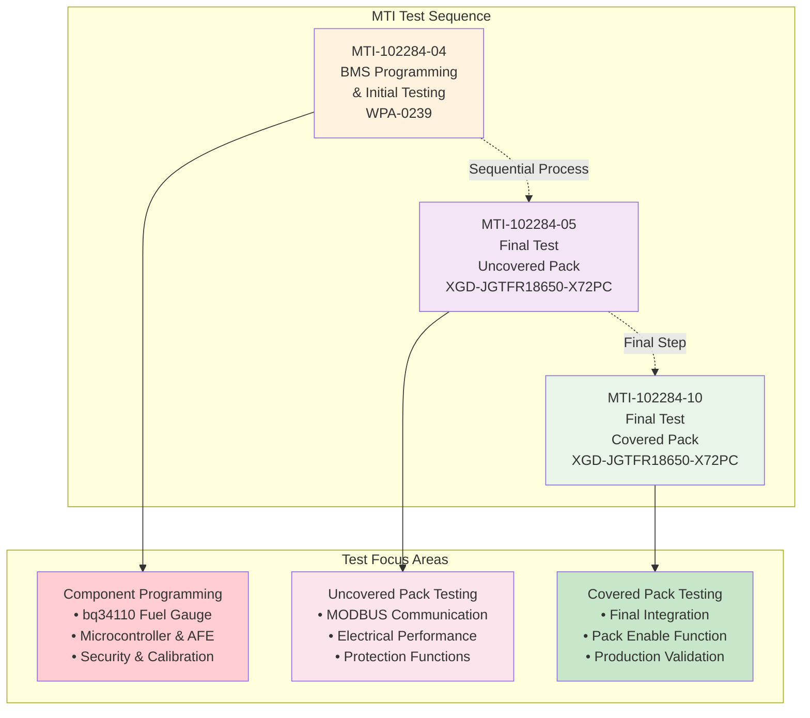
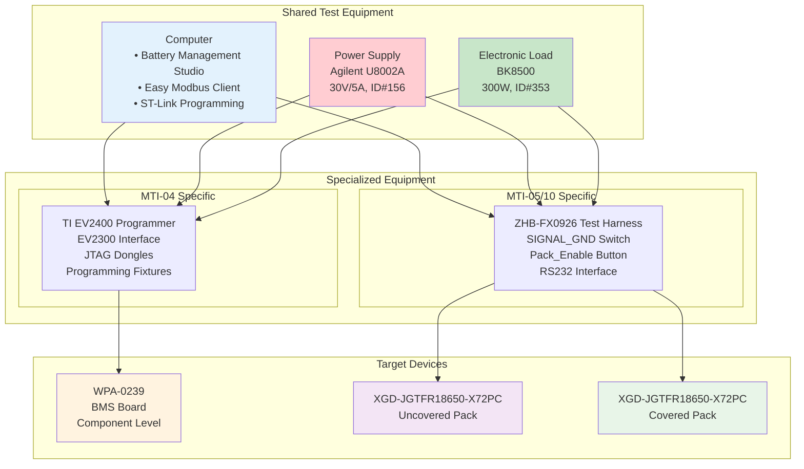
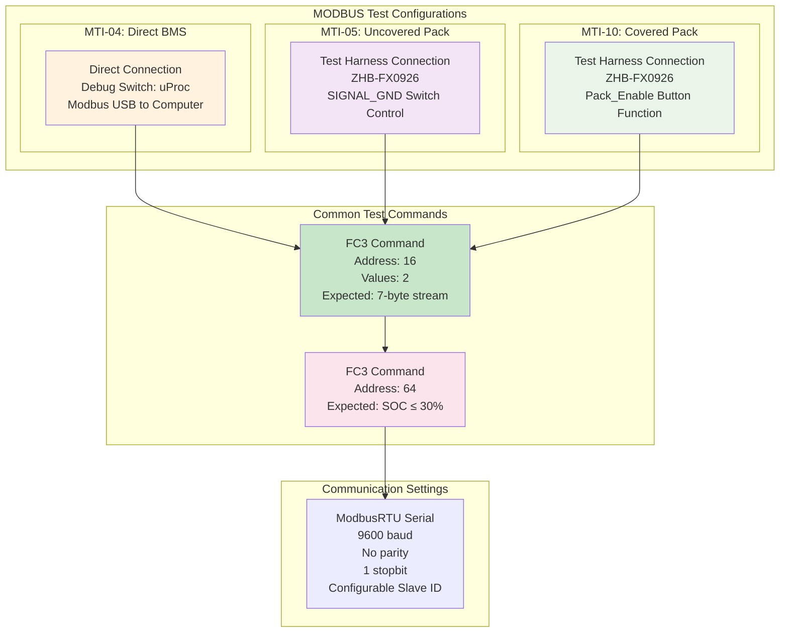
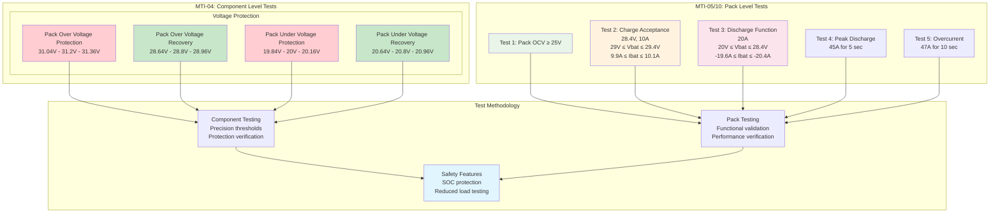
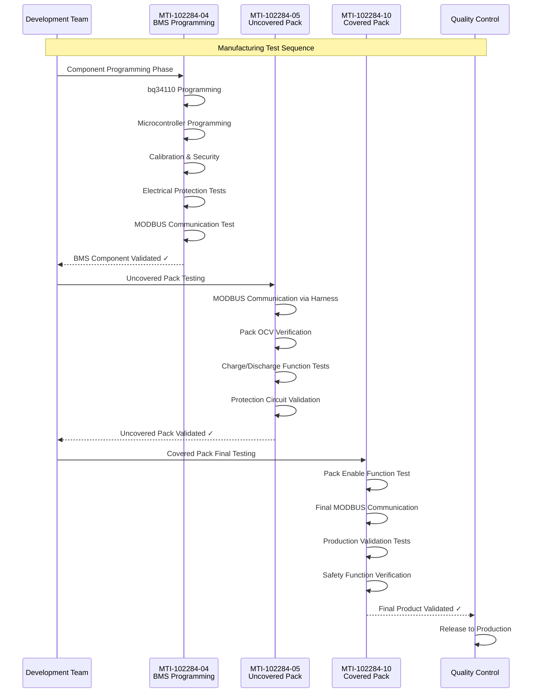
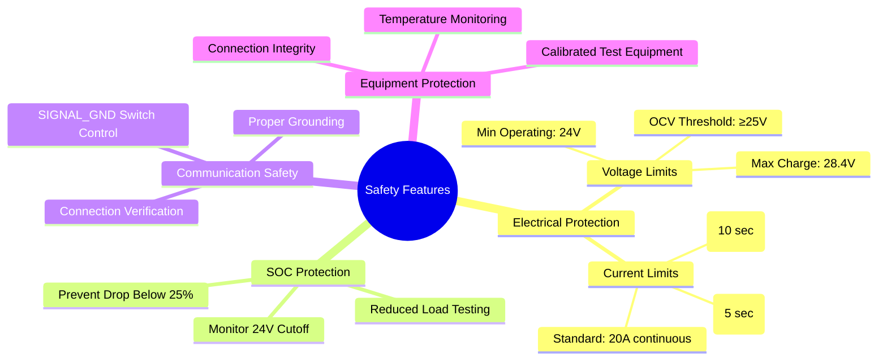

# MTI Complete Diagrams Summary

## Overview
This document provides a comprehensive summary of all Mermaid diagrams generated for the MTI (Manufacturing Test Instruction) JSON files in the GA_Modbus_Sim project.

## Document Index
- **MTI-102284-04**: BMS Test Instruction (WPA-0239 Programming and Testing)
- **MTI-102284-05**: Final Test with Uncovered Pack (XGD-JGTFR18650-X72PC)
- **MTI-102284-10**: Final Test with Covered Pack (XGD-JGTFR18650-X72PC)

## MTI Process Relationship Overview

## Common Equipment and Test Infrastructure

## MODBUS Communication Testing Matrix

## Electrical Test Requirements Comparison

## Test Sequence Flow Integration

## Key Differences and Similarities

### MTI-102284-04 (BMS Programming)
**Focus**: Component-level programming and calibration
- **Target**: WPA-0239 BMS board
- **Key Operations**: IC programming, calibration, security operations
- **Test Equipment**: Programming fixtures, TI tools, direct connections
- **Precision**: High-precision voltage thresholds for protection circuits

### MTI-102284-05 (Uncovered Pack)
**Focus**: Pack-level functional validation without enclosure
- **Target**: XGD-JGTFR18650-X72PC battery pack
- **Key Operations**: MODBUS via test harness, electrical performance
- **Test Equipment**: ZHB-FX0926 harness, SIGNAL_GND switch control
- **Validation**: Functional performance within operational ranges

### MTI-102284-10 (Covered Pack)
**Focus**: Final production validation with pack enclosure
- **Target**: XGD-JGTFR18650-X72PC in final covered state
- **Key Operations**: Pack enable function, final integration testing
- **Test Equipment**: Same harness, Pack_Enable button functionality
- **Validation**: Production-ready final validation

## Common Safety Considerations

## File References
- **MTI-102284-04-diagram.md**: Complete workflow and technical diagrams for BMS programming
- **MTI-102284-05-diagram.md**: Uncovered pack testing procedures and validation
- **MTI-102284-10-diagram.md**: Covered pack final testing and production validation

## Technical Notes
1. All diagrams use Mermaid syntax and are compatible with standard Markdown renderers
2. Each MTI document has been analyzed for workflow, equipment, testing procedures, and safety considerations
3. Common patterns across all MTI documents have been identified and documented
4. Sequential relationships between MTI processes have been established
5. Safety and protection features are consistently emphasized across all test procedures

## Usage Guidelines
- These diagrams can be used for training, documentation, and process improvement
- Each diagram is modular and can be updated independently
- The summary provides cross-references and relationship mapping
- Safety considerations are highlighted throughout all procedures