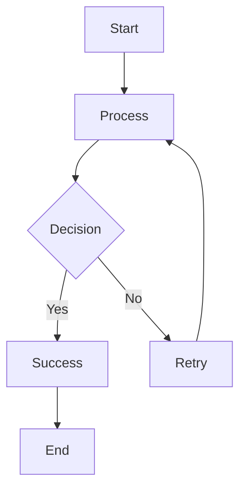
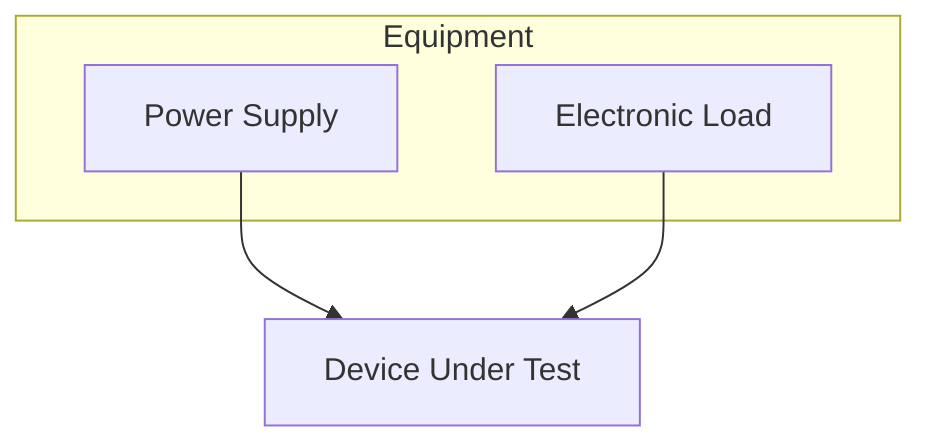

# Test Mermaid Syntax

This is a simple test to validate the Mermaid diagrams are properly formatted.

## Simple Test Diagram

## Test Equipment Diagram

If these render correctly, the syntax issues in MTI-102284-05 should be resolved.