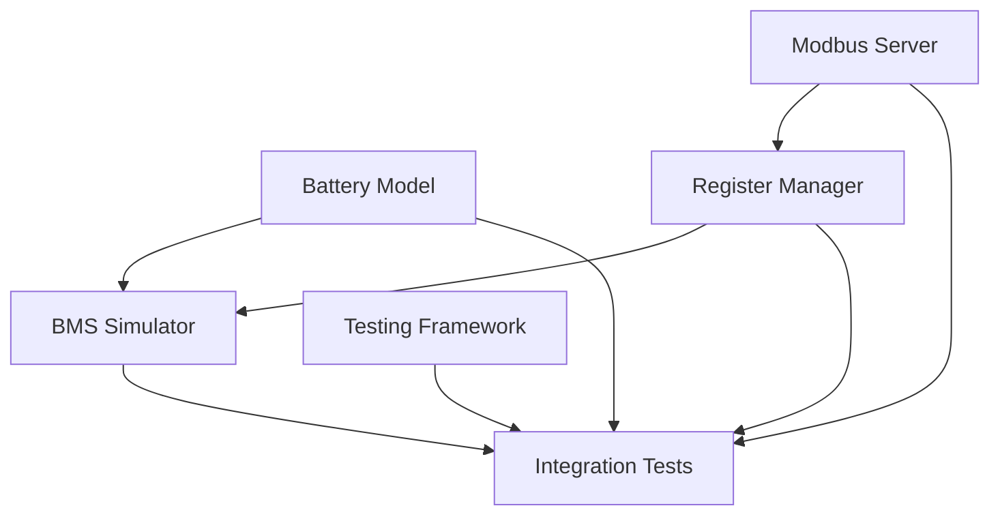

# Phase 1 Dependency Graph

## Component Dependencies



## Development Order

### Phase 1.1 - Foundation (Days 1-2)
**Can be developed in parallel:**

1. **Battery Model** (Independent)
   - Core battery physics simulation
   - Voltage/current calculations
   - No external dependencies

2. **Modbus Server** (Independent)
   - TCP/RTU server implementation
   - Connection management
   - Basic command handling

### Phase 1.2 - Integration Layer (Days 3-4)
**Depends on Phase 1.1:**

3. **Register Manager** 
   - **Depends on:** Modbus Server
   - Maps Modbus registers to system values
   - Handles register read/write operations

### Phase 1.3 - Business Logic (Days 5-6)
**Depends on Phase 1.1 & 1.2:**

4. **BMS Simulator**
   - **Depends on:** Battery Model + Register Manager
   - Coordinates battery management logic
   - Implements safety and control algorithms

### Phase 1.4 - Testing & Validation (Days 7)
**Depends on all previous phases:**

5. **Testing Framework & Integration**
   - **Depends on:** All components
   - Comprehensive test coverage
   - Integration testing

## Critical Path Analysis

### Longest Path (7 days):
```
Modbus Server → Register Manager → BMS Simulator → Integration Tests
```

### Parallel Development Opportunities:

1. **Days 1-2**: Battery Model + Modbus Server (parallel)
2. **Days 3-4**: Register Manager (depends on Modbus Server)
3. **Days 5-6**: BMS Simulator (depends on Battery Model + Register Manager)
4. **Day 7**: Testing & Integration

## Task Dependencies Detail

### Modbus Server Dependencies
- **Internal:** None
- **External:** pymodbus library
- **Blocks:** Register Manager

### Register Manager Dependencies  
- **Internal:** Modbus Server completion
- **External:** None
- **Blocks:** BMS Simulator

### Battery Model Dependencies
- **Internal:** None  
- **External:** numpy, scipy (for calculations)
- **Blocks:** BMS Simulator

### BMS Simulator Dependencies
- **Internal:** Battery Model + Register Manager
- **External:** None
- **Blocks:** Integration Tests

### Testing Framework Dependencies
- **Internal:** All components for integration tests
- **External:** pytest, pytest-asyncio
- **Blocks:** Phase completion

## Risk Mitigation

### Dependency Risks:
1. **Modbus Server delays** → Impacts Register Manager → Impacts BMS Simulator
   - **Mitigation:** Start with simple TCP implementation first
   
2. **Battery Model complexity** → Impacts BMS Simulator  
   - **Mitigation:** Begin with basic linear model, enhance later

3. **Integration complexity** → Impacts testing phase
   - **Mitigation:** Unit test each component thoroughly before integration

## Communication Interfaces

### Between Components:

1. **Battery Model ↔ BMS Simulator**
   - Battery state updates
   - Command execution (charge/discharge)
   - Status reporting

2. **Modbus Server ↔ Register Manager**
   - Register read/write requests
   - Data validation
   - Response formatting

3. **Register Manager ↔ BMS Simulator**
   - System state queries
   - Command forwarding
   - Status updates

4. **BMS Simulator ↔ All Components**
   - Central coordination
   - Safety monitoring
   - State management

## Coordination Points

### Daily Standups Focus:
- **Day 1-2:** Parallel development progress (Battery + Modbus)
- **Day 3-4:** Register Manager integration with Modbus
- **Day 5-6:** BMS integration with Battery + Register components  
- **Day 7:** Testing coordination and issue resolution

### Integration Checkpoints:
1. **Checkpoint 1 (Day 2):** Modbus Server + Battery Model unit tests passing
2. **Checkpoint 2 (Day 4):** Register Manager integrated with Modbus Server
3. **Checkpoint 3 (Day 6):** BMS Simulator integrated with all components
4. **Checkpoint 4 (Day 7):** Full integration tests passing