# Cell Runaway Detection and Response Sequence Diagram

## Overview
This document contains a comprehensive Mermaid sequence diagram showing the complete cell runaway detection and response sequence for the GA Modbus BMS Simulator. The diagram illustrates both rapid escalation (57 seconds) and gradual progression (3+ hours) scenarios with specific voltage thresholds, temperature progression, and P3E detection layers.

## Field Data Reference
- **Pack 0533**: Primary rapid escalation reference (Cell #6 failure)
- **Pack 0535**: Gradual progression reference (thermal cascade)

## Mermaid Sequence Diagram

```mermaid
sequenceDiagram
    participant BMS as BMS Controller
    participant Cell6 as Cell #6 (Primary Risk)
    participant TM as Thermal Model
    participant P1 as P1 Detection (Cell Level)
    participant P2 as P2 Detection (Module Level)
    participant P3 as P3 Detection (Pack Level)
    participant P4 as P4 Detection (System Level)
    participant ES as Emergency Systems
    participant Operator as Human Operator

    Note over BMS, Operator: Initial Conditions: SOC 85% (Charge) / 20% (Discharge), Temp 20°C

    %% Normal Operation Phase
    BMS->>Cell6: Monitor cell voltage (3.7V nominal)
    BMS->>TM: Monitor temperature (20°C)
    Cell6->>BMS: Report normal parameters
    TM->>BMS: Report normal thermal status

    %% SCENARIO 1: RAPID ESCALATION (57 seconds)
    Note over BMS, Operator: === RAPID ESCALATION SCENARIO (Pack 0533) ===
    
    Note right of Cell6: T+0s: Initial fault trigger
    Cell6->>BMS: Voltage anomaly detected (100mV deviation)
    BMS->>P1: Activate P1 detection layer
    P1->>BMS: ALERT: Cell #6 voltage deviation 100mV
    
    Note right of Cell6: T+5s: Thermal runaway initiation
    Cell6->>TM: Temperature spike begins (20°C → 35°C)
    TM->>BMS: Thermal gradient detected
    BMS->>P2: Escalate to P2 (Module Level)
    P2->>BMS: WARNING: Module thermal anomaly
    
    Note right of Cell6: T+12s: Critical voltage threshold
    Cell6->>BMS: Voltage deviation 300mV
    BMS->>P1: Update P1 status - CRITICAL
    P1->>BMS: CRITICAL: Cell #6 entering runaway
    
    Note right of Cell6: T+18s: Temperature acceleration
    Cell6->>TM: Temperature 45°C (rapid rise)
    TM->>BMS: Critical thermal rate detected
    BMS->>P3: Escalate to P3 (Pack Level)
    P3->>BMS: CRITICAL: Pack-level thermal event
    
    Note right of Cell6: T+25s: Severe voltage deviation
    Cell6->>BMS: Voltage deviation 500mV
    BMS->>ES: Initiate emergency protocols
    ES->>BMS: Emergency cooling activated
    ES->>Operator: ALARM: Cell runaway detected
    
    Note right of Cell6: T+35s: Thermal cascade risk
    Cell6->>TM: Temperature 55°C
    TM->>BMS: Adjacent cell heating detected
    BMS->>P4: Escalate to P4 (System Level)
    P4->>BMS: EMERGENCY: System-wide protection
    
    Note right of Cell6: T+45s: Maximum voltage deviation
    Cell6->>BMS: Voltage deviation 700mV
    BMS->>ES: Maximum emergency response
    ES->>BMS: Isolation protocols activated
    ES->>Operator: EMERGENCY: Immediate evacuation
    
    Note right of Cell6: T+57s: Critical failure point
    Cell6->>BMS: Voltage deviation 1000mV
    Cell6->>TM: Temperature 65°C (thermal runaway)
    BMS->>ES: SYSTEM SHUTDOWN
    ES->>Operator: CRITICAL: System emergency shutdown
    P4->>ES: Activate fire suppression
    
    %% Recovery/Isolation Phase
    Note over BMS, Operator: === EMERGENCY RESPONSE PHASE ===
    ES->>BMS: Isolate affected module
    BMS->>Cell6: Disconnect from system
    ES->>TM: Emergency cooling maximum
    Operator->>ES: Acknowledge emergency
    ES->>Operator: Status: System isolated, cooling active

    %% SCENARIO 2: GRADUAL PROGRESSION (3+ hours)
    Note over BMS, Operator: === GRADUAL PROGRESSION SCENARIO (Pack 0535) ===
    
    Note right of Cell6: T+0min: Subtle initial anomaly
    Cell6->>BMS: Minor voltage drift (50mV)
    BMS->>P1: Monitor cell deviation
    P1->>BMS: INFO: Minor cell anomaly detected
    
    Note right of Cell6: T+30min: Slow degradation
    Cell6->>BMS: Voltage deviation increases (100mV)
    BMS->>TM: Request thermal check
    TM->>BMS: Slight temperature increase (22°C)
    BMS->>P1: Update monitoring frequency
    
    Note right of Cell6: T+1hr: Progressive failure
    Cell6->>BMS: Voltage deviation 200mV
    Cell6->>TM: Temperature 28°C
    TM->>BMS: Gradual thermal rise detected
    BMS->>P2: Escalate to module monitoring
    P2->>BMS: WARNING: Gradual cell degradation
    
    Note right of Cell6: T+1.5hr: Accelerating degradation
    Cell6->>BMS: Voltage deviation 300mV
    Cell6->>TM: Temperature 35°C
    BMS->>Operator: ALERT: Cell degradation accelerating
    Operator->>BMS: Acknowledge - continue monitoring
    
    Note right of Cell6: T+2hr: Critical threshold approach
    Cell6->>BMS: Voltage deviation 400mV
    Cell6->>TM: Temperature 42°C
    TM->>BMS: Thermal acceleration detected
    BMS->>P3: Escalate to pack level
    P3->>BMS: WARNING: Pack-level concern
    
    Note right of Cell6: T+2.5hr: Rapid phase begins
    Cell6->>BMS: Voltage deviation 500mV
    Cell6->>TM: Temperature 48°C
    BMS->>ES: Prepare emergency systems
    ES->>BMS: Emergency systems on standby
    ES->>Operator: CAUTION: Prepare for emergency
    
    Note right of Cell6: T+3hr: Transition to rapid phase
    Cell6->>BMS: Voltage deviation 600mV
    Cell6->>TM: Temperature 52°C (acceleration point)
    BMS->>P4: System-level alert
    P4->>BMS: ALERT: Transition to rapid phase
    
    Note right of Cell6: T+3hr 15min: Emergency phase
    Cell6->>BMS: Voltage deviation 800mV
    Cell6->>TM: Temperature 58°C
    BMS->>ES: Activate emergency protocols
    ES->>Operator: WARNING: Emergency phase active
    
    Note right of Cell6: T+3hr 25min: Critical failure
    Cell6->>BMS: Voltage deviation 1000mV
    Cell6->>TM: Temperature 65°C (thermal runaway)
    BMS->>ES: EMERGENCY SHUTDOWN
    ES->>Operator: EMERGENCY: System shutdown
    P4->>ES: Full emergency response
    
    %% Final Response
    Note over BMS, Operator: === SYSTEM PROTECTION RESPONSE ===
    ES->>BMS: Complete system isolation
    BMS->>All: Shutdown all operations
    ES->>TM: Maximum cooling deployment
    ES->>Operator: Status: Emergency protocols active
    Operator->>ES: Emergency response team dispatched
```

## Key Detection Thresholds and Timing

### Voltage Deviation Thresholds
- **100mV**: Initial detection trigger (P1 activation)
- **300mV**: Critical cell-level threshold (P2 escalation)
- **500mV**: Emergency protocol initiation (P3 activation)
- **700mV**: Maximum emergency response (P4 activation)
- **1000mV**: System shutdown threshold

### Temperature Progression
- **20°C**: Normal operating temperature
- **35°C**: Initial thermal concern
- **45°C**: Rapid escalation indicator
- **55°C**: Thermal cascade risk
- **65°C**: Thermal runaway confirmed

### SOC-Based Risk Factors
- **85% SOC (Charge)**: Higher risk during charging operations
- **20% SOC (Discharge)**: Increased risk during deep discharge

### P3E Detection Layers
- **P1 (Cell Level)**: Individual cell monitoring and initial detection
- **P2 (Module Level)**: Module-wide thermal and electrical monitoring
- **P3 (Pack Level)**: Pack-level protection and coordination
- **P4 (System Level)**: System-wide emergency response and isolation

## Scenario Timing Comparison

### Rapid Escalation (Pack 0533 Pattern)
- **0-12 seconds**: Initial detection and thermal spike
- **12-25 seconds**: Critical threshold crossing
- **25-45 seconds**: Emergency response activation
- **45-57 seconds**: System shutdown and isolation

### Gradual Progression (Pack 0535 Pattern)
- **0-90 minutes**: Slow degradation phase
- **90-150 minutes**: Accelerating degradation
- **150-180 minutes**: Critical approach phase
- **180-185 minutes**: Rapid transition phase
- **185-205 minutes**: Emergency shutdown

## Critical Decision Points

1. **100mV Threshold**: First automated detection trigger
2. **300mV + Thermal Rise**: Human operator notification
3. **500mV Threshold**: Emergency system activation
4. **Temperature >50°C**: Prepare for rapid escalation
5. **1000mV Threshold**: Immediate system shutdown

## Emergency Response Actions

### Immediate Actions (Automated)
- Cell isolation and disconnection
- Emergency cooling system activation
- Adjacent cell monitoring intensification
- System load reduction/shutdown

### Human Operator Actions
- Acknowledge emergency status
- Coordinate emergency response team
- Initiate evacuation procedures if required
- Document incident for analysis

## Implementation Notes

This sequence diagram serves as the foundation for:
- BMS simulator logic implementation
- Emergency response procedure training
- P3E detection algorithm validation  
- Field incident analysis correlation
- Safety system verification testing

The diagram incorporates real field data patterns from Pack 0533 (rapid escalation) and Pack 0535 (gradual progression) to ensure realistic simulation scenarios.