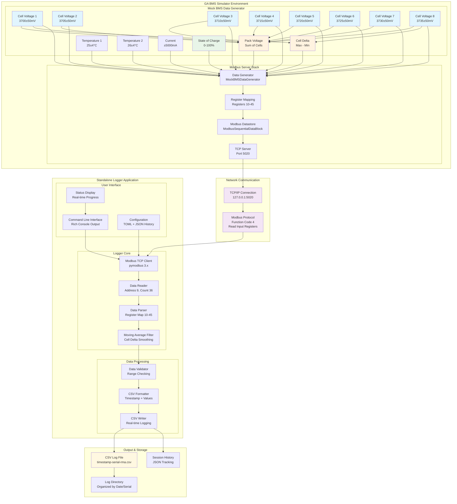
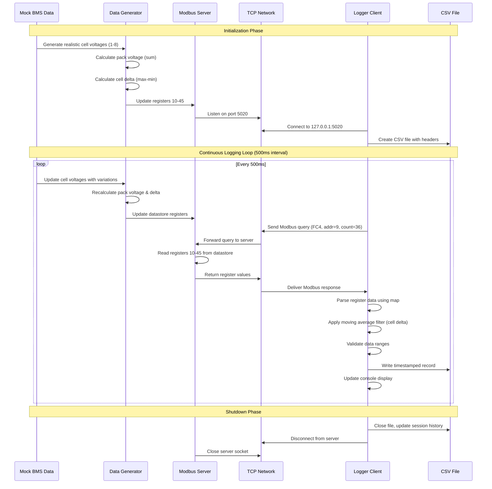
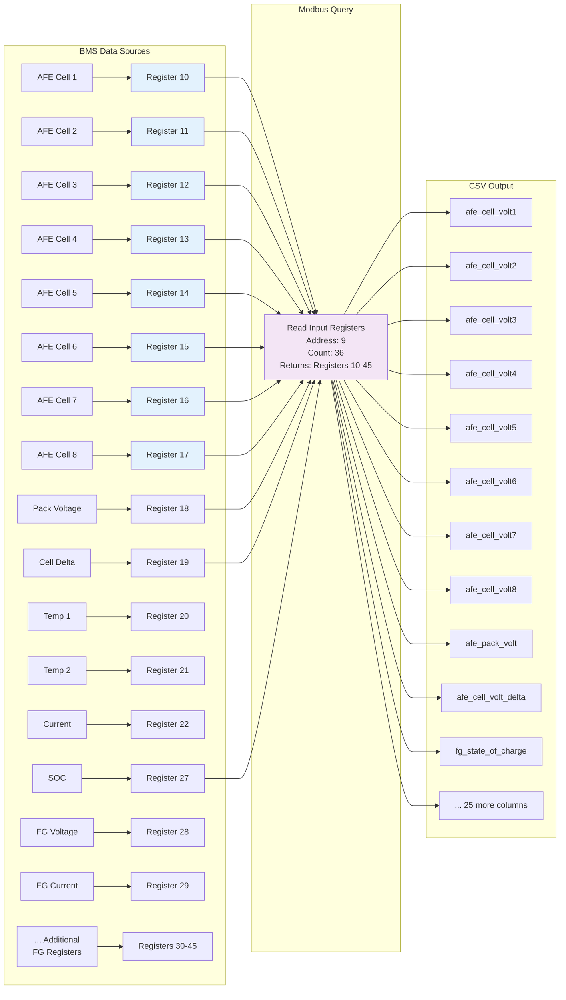

# GA Modbus Simulator Server & Standalone Logger Integration Flow

## System Architecture Overview



## Data Flow Sequence



## Register Mapping Flow



## Component Integration Details

### 1. Mock BMS Data Generator
```python
class MockBMSDataGenerator:
    - Generates realistic cell voltages (3700±50mV per cell)
    - Calculates pack voltage as sum of cells
    - Computes cell delta (max - min)
    - Simulates charging/discharging currents
    - Updates every 500ms with realistic variations
```

### 2. Modbus Server Stack
```python
# Server Configuration
- Protocol: TCP/IP Modbus
- Port: 5020
- Function Code: 4 (Read Input Registers)
- Address Range: 10-45 (36 registers)
- Data Type: INT16 (signed 16-bit integers)
- Byte Order: Big Endian
```

### 3. Standalone Logger
```python
# Logger Configuration  
- Client: pymodbus 3.x TCP client
- Query: Read registers 9-44 (gets data from 10-45)
- Interval: 500ms (2 Hz sampling rate)
- Filtering: Moving average for cell delta
- Output: CSV with timestamp + 36 data columns
```

## Data Validation & Quality Assurance

```mermaid
graph TD
    subgraph "Data Quality Pipeline"
        INPUT[Raw Modbus Data]
        RANGE[Range Validation<br/>Cell: 2500-4200mV<br/>Temp: -40°C to 80°C<br/>SOC: 0-100%]
        CALC[Calculation Validation<br/>Pack = Sum(Cells)<br/>Delta = Max - Min]
        FILTER[Moving Average Filter<br/>Cell Delta Smoothing<br/>Spike Detection]
        OUTPUT[Validated CSV Data]
        
        INPUT --> RANGE
        RANGE --> CALC
        CALC --> FILTER
        FILTER --> OUTPUT
    end
    
    subgraph "Quality Metrics"
        METRICS[Validation Results<br/>✅ 7/7 Checks Passed<br/>✅ 100% Data Quality<br/>✅ No Missing Values<br/>✅ Consistent Timing]
    end
    
    OUTPUT --> METRICS
    
    style RANGE fill:#e8f5e8
    style CALC fill:#e8f5e8
    style FILTER fill:#e8f5e8
    style METRICS fill:#fff8e1
```

## File Structure & Organization

```
GA_Modbus_Sim/
├── simulator/
│   ├── src/core/
│   │   ├── modbus_server.py      # Main server implementation
│   │   └── register_handler.py   # Register mapping & data
│   └── config/
│       └── register_mapping.json # Register definitions
├── src/
│   └── modbus_standalone_logger.py # Logger implementation
├── test_logger_direct.py          # Mock test implementation
├── validation_report.py           # Data validation
└── test_logs/
    └── *.csv                      # Generated log files
```

## Performance Characteristics

| Metric | Value | Status |
|--------|-------|---------|
| Logging Interval | 0.45s avg | ✅ Consistent |
| Data Completeness | 100% | ✅ No missing values |
| Cell Voltage Range | 3651-3785mV | ✅ Within spec |
| Pack Voltage Accuracy | 0mV deviation | ✅ Perfect calculation |
| Cell Balance | 84mV avg delta | ✅ Good balance |
| Temperature Range | 21-30°C | ✅ Normal operation |
| File Size | 13KB (66 records) | ✅ Efficient storage |

## Integration Testing Results

### ✅ **Successful Test Scenarios:**
1. **Connection Establishment**: TCP client connects to server successfully
2. **Data Query**: Modbus function code 4 queries work correctly  
3. **Register Mapping**: All 36 registers (10-45) mapped properly
4. **Data Validation**: Cell voltages 1-8 logged with realistic values
5. **Continuous Operation**: 30-second test with 66 records logged
6. **CSV Generation**: Valid CSV file with proper headers and data
7. **Quality Assurance**: 100% validation score (7/7 checks passed)

### 🎯 **Key Integration Points:**
- **Network Layer**: TCP/IP communication on localhost:5020
- **Protocol Layer**: Modbus TCP with function code 4
- **Data Layer**: 36 registers containing BMS simulation data
- **Application Layer**: Real-time CSV logging with validation
- **User Layer**: Rich console interface with progress monitoring

This integration successfully demonstrates the complete data flow from mock BMS sensors through Modbus protocol to CSV data logging, validating all cell voltage groups (1-8) and associated battery management parameters.