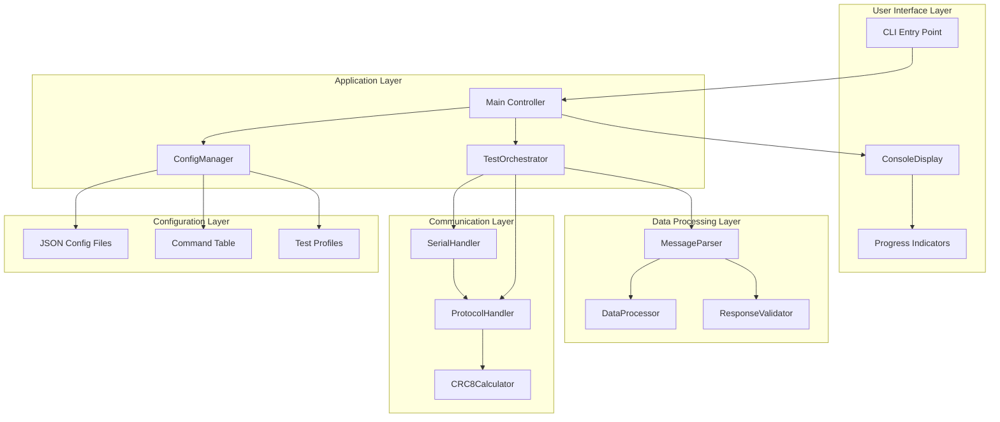
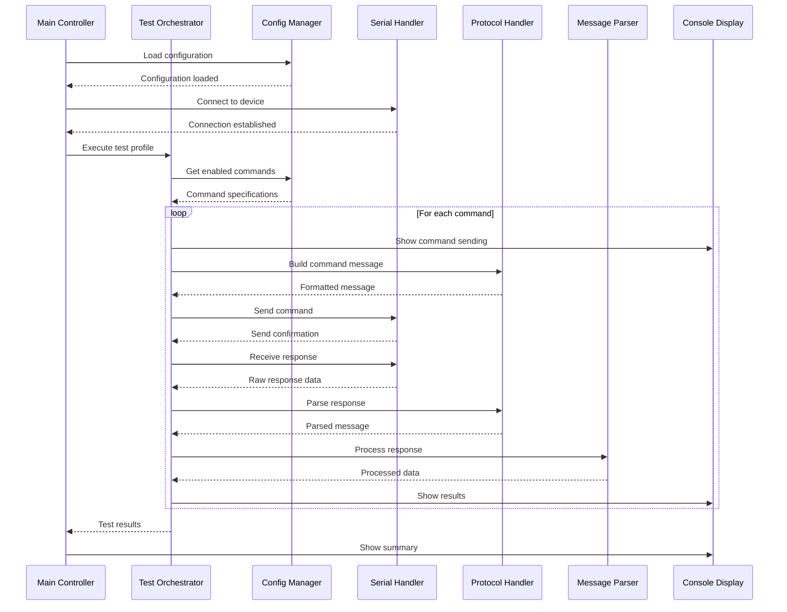
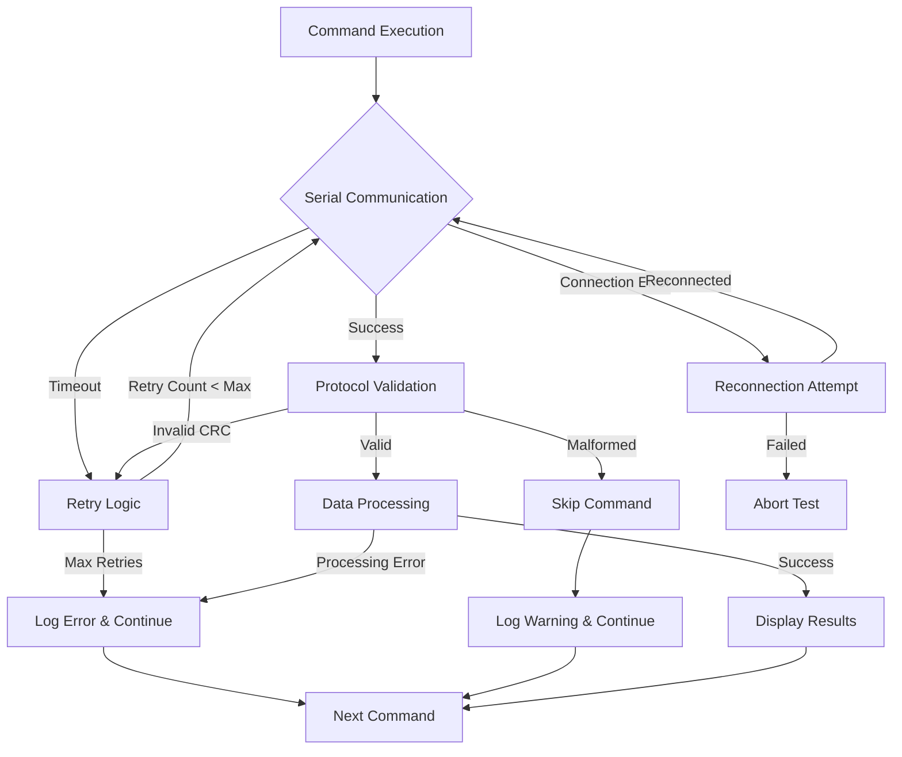

# GEHC PHTC RS422 Test Application - System Architecture

## 🏗️ Architecture Overview

This document defines the comprehensive system architecture for the GEHC PHTC RS422 Communication Protocol Test Application, designed using modular principles with clear separation of concerns.

### High-Level Architecture



## 📁 Project Structure

```
gehc_phtc_test/
├── src/                              # Core application modules
│   ├── __init__.py
│   ├── main.py                       # Application entry point & main controller
│   ├── communication/                # RS422 serial communication
│   │   ├── __init__.py
│   │   ├── serial_handler.py         # RS422 serial interface
│   │   ├── protocol_handler.py       # GEHC protocol implementation
│   │   └── crc8_calculator.py        # CRC8 checksum calculations
│   ├── parsing/                      # Message parsing and data processing
│   │   ├── __init__.py
│   │   ├── message_parser.py         # Response message parsing
│   │   ├── data_processor.py         # Data scaling and conversion
│   │   └── response_validator.py     # Response validation logic
│   ├── config/                       # Configuration management
│   │   ├── __init__.py
│   │   ├── config_manager.py         # Configuration loading and validation
│   │   └── types.py                  # Pydantic data models and types
│   ├── display/                      # Console output with Rich library
│   │   ├── __init__.py
│   │   ├── console_display.py        # Rich library formatting
│   │   └── progress_display.py       # Progress indicators and status
│   └── orchestration/                # Test coordination and workflow
│       ├── __init__.py
│       └── test_orchestrator.py      # Test execution coordination
├── config/                           # Configuration files
│   ├── config.json                   # Serial port and timing settings
│   ├── commands.json                 # Command table with enable/disable flags
│   └── command_profiles.json         # Predefined test profiles
├── tests/                            # Unit and integration tests
│   ├── __init__.py
│   ├── unit/                         # Unit tests by module
│   │   ├── test_communication.py
│   │   ├── test_parsing.py
│   │   ├── test_config.py
│   │   └── test_display.py
│   ├── integration/                  # Integration tests
│   │   ├── test_end_to_end.py
│   │   └── test_protocol_flow.py
│   └── fixtures/                     # Test data and mocks
│       ├── mock_responses.py
│       └── test_configs.py
├── docs/                             # Documentation
│   ├── architecture.md               # This file
│   ├── api_reference.md              # API documentation
│   └── protocol_spec.md              # Protocol implementation details
├── requirements.txt                  # Python dependencies
├── setup.py                          # Package setup configuration
└── README.md                         # Project overview
```

## 🔧 Core Component Architecture

### 1. Main Controller (`main.py`)

The main controller orchestrates the entire application lifecycle and coordinates all components.

```python
class MainController:
    """Main application controller coordinating all components."""
    
    def __init__(self):
        self.config_manager = ConfigManager()
        self.serial_handler = SerialHandler()
        self.protocol_handler = ProtocolHandler()
        self.message_parser = MessageParser()
        self.console_display = ConsoleDisplay()
        self.test_orchestrator = TestOrchestrator()
    
    async def run(self, profile: str = "full_implemented") -> TestResults:
        """Execute the complete test workflow."""
        
    def initialize_components(self) -> bool:
        """Initialize and validate all components."""
        
    def cleanup_resources(self) -> None:
        """Clean shutdown of all resources."""
```

### 2. Communication Layer

#### SerialHandler (`communication/serial_handler.py`)

Handles low-level RS422 serial communication with robust error handling and connection management.

```python
from typing import Optional, Tuple
from enum import Enum
import serial
import asyncio

class ConnectionState(Enum):
    DISCONNECTED = "disconnected"
    CONNECTING = "connecting"
    CONNECTED = "connected"
    ERROR = "error"

class SerialHandler:
    """Manages RS422 serial communication with PHTC device."""
    
    def __init__(self, port: str, baud_rate: int = 115200, timeout: float = 1.0):
        self.port = port
        self.baud_rate = baud_rate
        self.timeout = timeout
        self.connection: Optional[serial.Serial] = None
        self.state = ConnectionState.DISCONNECTED
        self._lock = asyncio.Lock()
    
    async def connect(self) -> bool:
        """Establish connection to RS422 device."""
        
    async def disconnect(self) -> None:
        """Close RS422 connection safely."""
        
    async def send_data(self, data: bytes) -> bool:
        """Send raw data to RS422 port with error handling."""
        
    async def receive_data(self, expected_length: int = None) -> Optional[bytes]:
        """Receive data from RS422 port with timeout handling."""
        
    def is_connected(self) -> bool:
        """Check current connection status."""
        
    async def flush_buffers(self) -> None:
        """Clear input/output buffers."""
    
    @property
    def connection_info(self) -> dict:
        """Get current connection information."""
```

#### ProtocolHandler (`communication/protocol_handler.py`)

Implements the GEHC RS422 protocol with proper message formatting and validation.

```python
from typing import Tuple, Optional
from dataclasses import dataclass

@dataclass
class GEHCMessage:
    """GEHC protocol message structure."""
    preamble: int = 0xAA
    sync_header: int = 0x23  # Host to Battery
    command_code: int = 0x00
    data_length: int = 0
    data: bytes = b''
    crc8: int = 0

class ProtocolHandler:
    """GEHC RS422 protocol implementation."""
    
    def __init__(self, crc_calculator: 'CRC8Calculator'):
        self.crc_calculator = crc_calculator
        self.preamble = 0xAA
        self.sync_header_h2b = 0x23  # Host to Battery
        self.sync_header_b2h = 0x40  # Battery to Host
    
    def build_command_message(self, command_code: int, data: bytes = b'') -> bytes:
        """Build complete GEHC protocol message."""
        
    def parse_response_message(self, response: bytes) -> Tuple[bool, Optional[GEHCMessage]]:
        """Parse and validate GEHC response message."""
        
    def validate_message_structure(self, message: bytes) -> bool:
        """Validate message format and structure."""
        
    def extract_payload(self, message: GEHCMessage) -> bytes:
        """Extract data payload from validated message."""
    
    def calculate_message_crc(self, message_data: bytes) -> int:
        """Calculate CRC8 for message data."""
        
    def format_hex_dump(self, data: bytes) -> str:
        """Format binary data as hex dump for debugging."""
```

#### CRC8Calculator (`communication/crc8_calculator.py`)

Implements SMBus PEC polynomial CRC8 calculation as specified in the GEHC protocol.

```python
class CRC8Calculator:
    """SMBus PEC polynomial CRC8 calculator for GEHC protocol."""
    
    def __init__(self):
        self.polynomial = 0x07  # SMBus PEC polynomial
        self._lookup_table = self._generate_lookup_table()
    
    def calculate(self, data: bytes) -> int:
        """Calculate CRC8 checksum for data."""
        
    def verify(self, data: bytes, expected_crc: int) -> bool:
        """Verify data integrity against expected CRC."""
        
    def _generate_lookup_table(self) -> List[int]:
        """Generate CRC8 lookup table for performance."""
```

### 3. Data Processing Layer

#### MessageParser (`parsing/message_parser.py`)

Parses GEHC protocol responses and coordinates data processing.

```python
from typing import Dict, Any, Optional
from .data_processor import DataProcessor
from .response_validator import ResponseValidator

class MessageParser:
    """GEHC protocol message parsing and coordination."""
    
    def __init__(self, data_processor: DataProcessor, validator: ResponseValidator):
        self.data_processor = data_processor
        self.validator = validator
    
    async def parse_response(
        self, 
        command_code: int, 
        response_data: bytes,
        command_info: Dict[str, Any]
    ) -> ParsedResponse:
        """Parse complete response with validation and processing."""
        
    def extract_raw_value(self, data: bytes, data_type: str) -> Any:
        """Extract raw value based on data type specification."""
        
    async def process_command_response(
        self,
        command_code: int,
        response: GEHCMessage,
        command_spec: CommandSpec
    ) -> ProcessedResponse:
        """Process complete command response with all transformations."""

@dataclass
class ParsedResponse:
    """Structured response data."""
    command_code: int
    command_name: str
    raw_value: Any
    scaled_value: float
    formatted_value: str
    unit: str
    timestamp: datetime
    valid: bool
    errors: List[str]
```

#### DataProcessor (`parsing/data_processor.py`)

Handles data type conversion, scaling, and unit formatting.

```python
from typing import Any, Dict, Union
from enum import Enum

class DataType(Enum):
    UNSIGNED_INT = "unsigned int"
    SIGNED_INT = "signed int"
    WORD = "word"
    BOOLEAN = "Boolean"
    STRING = "string"
    BLOCK_DATA = "block data"

class DataProcessor:
    """Data type conversion and scaling processor."""
    
    def __init__(self):
        self.type_formats = {
            DataType.UNSIGNED_INT: {"size": 2, "format": "H", "signed": False},
            DataType.SIGNED_INT: {"size": 2, "format": "h", "signed": True},
            DataType.WORD: {"size": 2, "format": "H", "signed": False},
            DataType.BOOLEAN: {"size": 2, "format": "H", "converter": bool},
            DataType.STRING: {"size": "variable", "format": "s"},
            DataType.BLOCK_DATA: {"size": "variable", "format": "raw"}
        }
    
    def convert_data_type(self, data: bytes, data_type: DataType) -> Any:
        """Convert raw bytes to specified data type."""
        
    def apply_scaling(self, value: Union[int, float], granularity: float) -> float:
        """Apply granularity scaling to raw value."""
        
    def format_with_units(self, value: float, unit: str, precision: int = 2) -> str:
        """Format scaled value with appropriate units."""
        
    def validate_range(self, value: float, range_spec: str) -> bool:
        """Validate value is within specified range."""
        
    def get_type_info(self, data_type: str) -> Dict[str, Any]:
        """Get formatting information for data type."""
```

#### ResponseValidator (`parsing/response_validator.py`)

Validates response integrity, format, and content.

```python
from typing import List, Tuple
from enum import Enum

class ValidationError(Enum):
    INVALID_CRC = "invalid_crc"
    INVALID_LENGTH = "invalid_length"
    INVALID_FORMAT = "invalid_format"
    OUT_OF_RANGE = "out_of_range"
    TIMEOUT = "timeout"
    MALFORMED_DATA = "malformed_data"

class ResponseValidator:
    """Response validation and integrity checking."""
    
    def __init__(self, crc_calculator: CRC8Calculator):
        self.crc_calculator = crc_calculator
    
    def validate_response(
        self, 
        response: GEHCMessage, 
        expected_command: int
    ) -> Tuple[bool, List[ValidationError]]:
        """Comprehensive response validation."""
        
    def validate_crc(self, message: GEHCMessage) -> bool:
        """Validate message CRC8 checksum."""
        
    def validate_length(self, message: GEHCMessage, expected_length: int) -> bool:
        """Validate response data length."""
        
    def validate_command_match(self, response_cmd: int, expected_cmd: int) -> bool:
        """Validate response command matches request."""
        
    def validate_data_integrity(self, data: bytes, data_type: str) -> bool:
        """Validate data integrity and format."""
```

### 4. Configuration Management

#### ConfigManager (`config/config_manager.py`)

Manages all configuration loading, validation, and access.

```python
from typing import Dict, List, Any, Optional
from .types import SerialConfig, CommandSpec, TestProfile
from pathlib import Path

class ConfigManager:
    """Centralized configuration management."""
    
    def __init__(self, config_dir: Path = Path("config")):
        self.config_dir = config_dir
        self.serial_config: Optional[SerialConfig] = None
        self.command_table: Dict[str, CommandSpec] = {}
        self.test_profiles: Dict[str, TestProfile] = {}
        self._loaded = False
    
    async def load_all_configs(self) -> bool:
        """Load all configuration files."""
        
    def load_serial_config(self) -> SerialConfig:
        """Load serial port configuration."""
        
    def load_command_table(self) -> Dict[str, CommandSpec]:
        """Load command specifications."""
        
    def load_test_profiles(self) -> Dict[str, TestProfile]:
        """Load test profile definitions."""
        
    def get_enabled_commands(self, profile_name: str = None) -> List[CommandSpec]:
        """Get list of enabled commands for profile."""
        
    def is_command_implemented(self, command_code: str) -> bool:
        """Check if command is implemented."""
        
    def get_command_spec(self, command_code: str) -> Optional[CommandSpec]:
        """Get command specification."""
        
    def get_test_profile(self, profile_name: str) -> Optional[TestProfile]:
        """Get test profile configuration."""
        
    def validate_configuration(self) -> List[str]:
        """Validate all configuration files."""
```

#### Types (`config/types.py`)

Pydantic data models for type safety and validation.

```python
from pydantic import BaseModel, Field, validator
from typing import Dict, List, Optional, Union
from enum import Enum

class DataType(str, Enum):
    UNSIGNED_INT = "unsigned int"
    SIGNED_INT = "signed int"
    WORD = "word"
    BOOLEAN = "Boolean"
    STRING = "string"
    BLOCK_DATA = "block data"

class Priority(str, Enum):
    HIGH = "high"
    MEDIUM = "medium" 
    LOW = "low"

class SerialConfig(BaseModel):
    """Serial communication configuration."""
    serial_com_port: str = Field(..., description="Serial port identifier")
    baud_rate: int = Field(115200, description="Communication baud rate")
    timeout_ms: int = Field(1000, description="Response timeout in milliseconds")
    inter_command_delay: float = Field(0.5, description="Delay between commands in seconds")
    retry_count: int = Field(3, description="Number of retry attempts")
    command_table_file: str = Field("commands.json", description="Command table filename")
    log_unsupported_commands: bool = Field(True, description="Log unsupported command attempts")
    skip_unsupported_commands: bool = Field(True, description="Skip unsupported commands")

class CommandSpec(BaseModel):
    """Individual command specification."""
    name: str = Field(..., description="Command name")
    description: str = Field(..., description="Command description")
    enabled: bool = Field(True, description="Command enabled for testing")
    implemented: bool = Field(False, description="Command implementation status")
    datatype: DataType = Field(..., description="Response data type")
    unit: str = Field("", description="Value unit")
    range: str = Field("", description="Valid value range")
    granularity: float = Field(1.0, description="Scaling granularity")
    byte_count: int = Field(2, description="Expected response byte count")
    test_priority: Priority = Field(Priority.MEDIUM, description="Test priority level")
    notes: str = Field("", description="Implementation notes")

class TestProfile(BaseModel):
    """Test execution profile."""
    description: str = Field(..., description="Profile description")
    enabled_groups: List[str] = Field(default_factory=list, description="Enabled command groups")
    max_commands: int = Field(100, description="Maximum commands to execute")
    expect_failures: bool = Field(False, description="Expect some commands to fail")
    timeout_multiplier: float = Field(1.0, description="Timeout adjustment factor")
```

### 5. Display Layer

#### ConsoleDisplay (`display/console_display.py`)

Rich library integration for formatted console output.

```python
from rich.console import Console
from rich.table import Table
from rich.panel import Panel
from rich.text import Text
from rich.layout import Layout
from typing import Dict, List, Any

class ConsoleDisplay:
    """Rich library console display manager."""
    
    def __init__(self):
        self.console = Console()
        self.layout = Layout()
        self._setup_layout()
    
    def show_startup_banner(self, config: SerialConfig) -> None:
        """Display application startup banner."""
        
    def display_command_sending(self, command_spec: CommandSpec, message: bytes) -> None:
        """Show command transmission status."""
        
    def display_response_received(self, parsed_response: ParsedResponse) -> None:
        """Display parsed response data."""
        
    def display_error(self, error_type: str, message: str, details: str = None) -> None:
        """Display error information with formatting."""
        
    def display_final_summary(self, test_results: TestResults) -> None:
        """Show comprehensive test summary."""
        
    def create_command_status_table(self, commands: List[CommandSpec]) -> Table:
        """Create formatted command status table."""
        
    def create_results_table(self, results: List[ParsedResponse]) -> Table:
        """Create formatted results table."""
        
    def _setup_layout(self) -> None:
        """Initialize Rich layout structure."""
```

#### ProgressDisplay (`display/progress_display.py`)

Progress indicators and real-time status updates.

```python
from rich.progress import Progress, TaskID, SpinnerColumn, TimeElapsedColumn
from rich.live import Live
from typing import Optional

class ProgressDisplay:
    """Progress tracking and real-time status display."""
    
    def __init__(self, console: Console):
        self.console = console
        self.progress = Progress(
            SpinnerColumn(),
            "[progress.description]{task.description}",
            "[progress.percentage]{task.percentage:>3.0f}%",
            TimeElapsedColumn(),
            console=console
        )
        self.current_task: Optional[TaskID] = None
        self.live: Optional[Live] = None
    
    def start_test_progress(self, total_commands: int) -> None:
        """Initialize test execution progress tracking."""
        
    def update_command_progress(self, completed: int, current_command: str) -> None:
        """Update progress for current command."""
        
    def complete_progress(self) -> None:
        """Complete and cleanup progress display."""
        
    def show_real_time_status(self, status: str) -> None:
        """Display real-time status updates."""
```

### 6. Test Orchestration

#### TestOrchestrator (`orchestration/test_orchestrator.py`)

Coordinates the complete test execution workflow.

```python
from typing import List, Dict, Any
from dataclasses import dataclass
from datetime import datetime

@dataclass
class TestResults:
    """Complete test execution results."""
    profile_name: str
    start_time: datetime
    end_time: datetime
    total_commands: int
    successful_commands: int
    failed_commands: int
    skipped_commands: int
    results: List[ParsedResponse]
    errors: List[str]
    performance_metrics: Dict[str, float]

class TestOrchestrator:
    """Coordinates complete test execution workflow."""
    
    def __init__(
        self,
        config_manager: ConfigManager,
        serial_handler: SerialHandler,
        protocol_handler: ProtocolHandler,
        message_parser: MessageParser,
        console_display: ConsoleDisplay,
        progress_display: ProgressDisplay
    ):
        self.config_manager = config_manager
        self.serial_handler = serial_handler
        self.protocol_handler = protocol_handler
        self.message_parser = message_parser
        self.console_display = console_display
        self.progress_display = progress_display
    
    async def execute_test_profile(self, profile_name: str) -> TestResults:
        """Execute complete test profile."""
        
    async def execute_single_command(
        self, 
        command_spec: CommandSpec
    ) -> Tuple[bool, Optional[ParsedResponse]]:
        """Execute single command with full workflow."""
        
    async def send_command_with_retry(
        self,
        command_spec: CommandSpec,
        retry_count: int = 3
    ) -> Tuple[bool, Optional[bytes]]:
        """Send command with retry logic."""
        
    def calculate_performance_metrics(
        self, 
        results: List[ParsedResponse],
        start_time: datetime,
        end_time: datetime
    ) -> Dict[str, float]:
        """Calculate test performance metrics."""
        
    async def cleanup_test_session(self) -> None:
        """Clean up resources after test completion."""
```

## 🔄 Data Flow Architecture

### Command Execution Flow



### Error Handling Flow



## 🔧 Interface Contracts

### Inter-Component Communication

All components communicate through well-defined interfaces with proper error handling and type safety:

1. **Async/Await Pattern**: All I/O operations use async/await for non-blocking execution
2. **Type Hints**: Full type annotation for all public interfaces
3. **Error Propagation**: Structured error handling with specific exception types
4. **Resource Management**: Proper cleanup using context managers and async context managers
5. **Configuration Injection**: Dependencies injected through constructor parameters
6. **Event-Driven Updates**: Progress and status updates through callback mechanisms

### Key Design Principles

1. **Single Responsibility**: Each component has a clear, focused purpose
2. **Dependency Injection**: Components receive dependencies rather than creating them
3. **Interface Segregation**: Small, focused interfaces rather than large monolithic ones
4. **Open/Closed Principle**: Components open for extension, closed for modification
5. **Testability**: All components designed for easy unit and integration testing

## 🔐 Error Handling Strategy

### Error Categories

1. **Communication Errors**: Serial port issues, timeouts, connection failures
2. **Protocol Errors**: Invalid CRC, malformed messages, unexpected responses
3. **Data Errors**: Invalid data types, out-of-range values, scaling failures
4. **Configuration Errors**: Missing files, invalid JSON, incompatible settings
5. **System Errors**: Resource exhaustion, file system issues, permission problems

### Error Handling Approach

```python
class GEHCError(Exception):
    """Base exception for GEHC application."""
    pass

class CommunicationError(GEHCError):
    """Serial communication related errors."""
    pass

class ProtocolError(GEHCError):
    """GEHC protocol related errors."""
    pass

class ConfigurationError(GEHCError):
    """Configuration related errors."""
    pass

# Error handling pattern
try:
    result = await component.execute_operation()
except CommunicationError as e:
    logger.error(f"Communication failed: {e}")
    # Retry logic or graceful degradation
except ProtocolError as e:
    logger.warning(f"Protocol error: {e}")
    # Skip command or use default handling
except Exception as e:
    logger.critical(f"Unexpected error: {e}")
    # Clean shutdown or error reporting
```

## 📊 Performance Considerations

### Optimization Strategies

1. **Connection Pooling**: Reuse serial connections across commands
2. **Async I/O**: Non-blocking operations for better responsiveness  
3. **Caching**: Cache configuration data and parsed command specs
4. **Lazy Loading**: Load resources only when needed
5. **Memory Management**: Proper cleanup of large data structures
6. **Parallel Processing**: Where possible, parallel execution of independent operations

### Performance Targets

- Command processing latency: < 100ms (excluding communication time)
- Memory usage: < 50MB during operation
- CPU utilization: < 25% on modern hardware
- Test execution throughput: > 10 commands per minute
- Error recovery time: < 2 seconds for communication issues

This architecture provides a robust, maintainable, and scalable foundation for the GEHC PHTC RS422 test application while ensuring clear separation of concerns and comprehensive error handling.