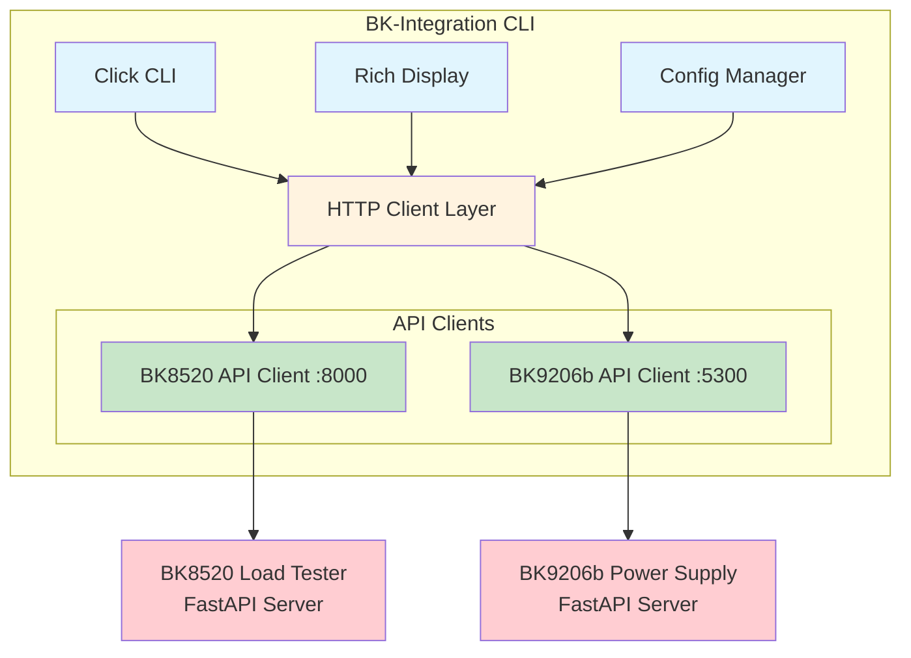
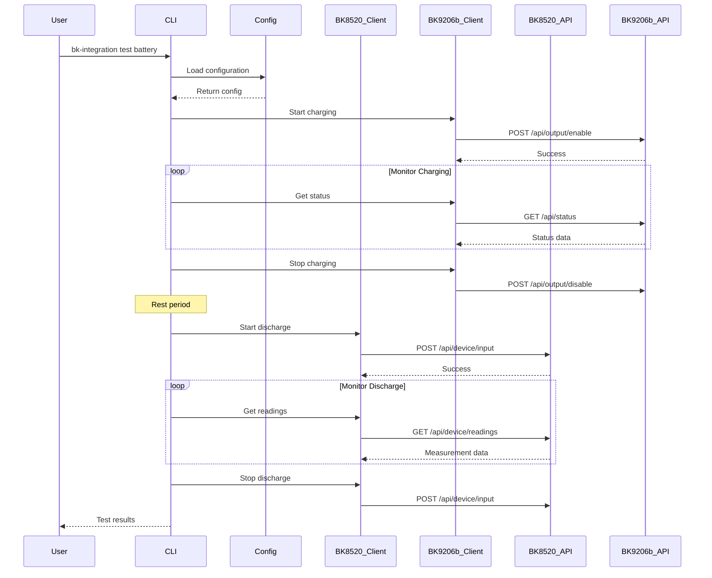
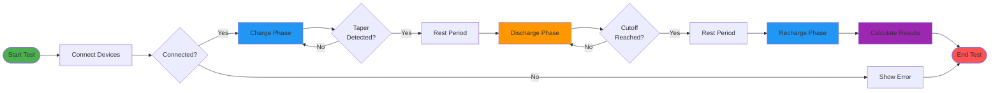
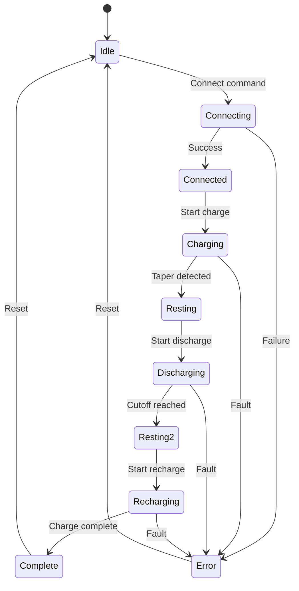
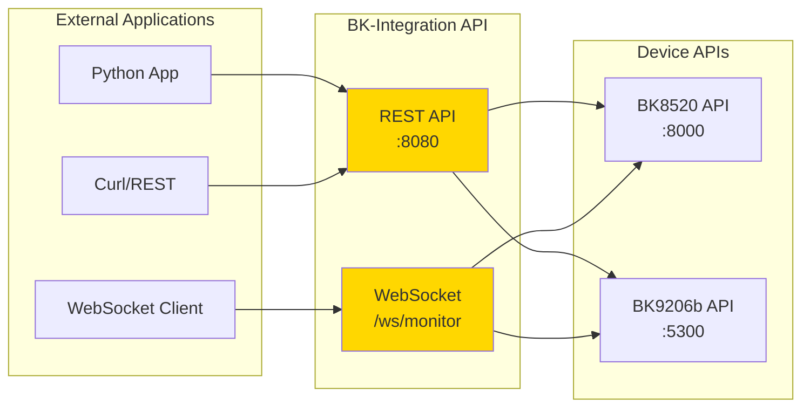
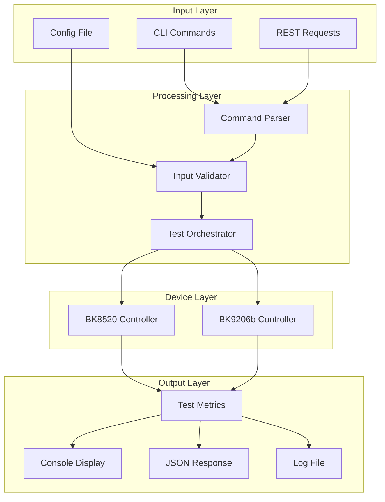
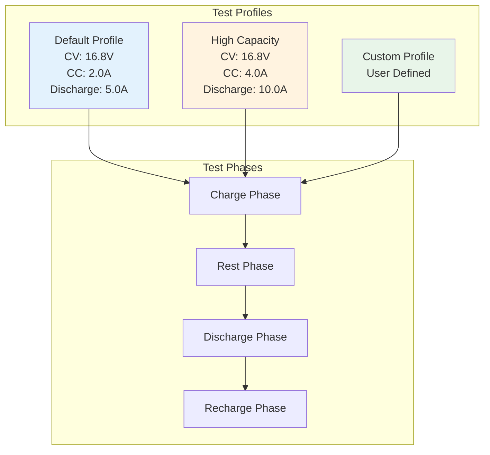
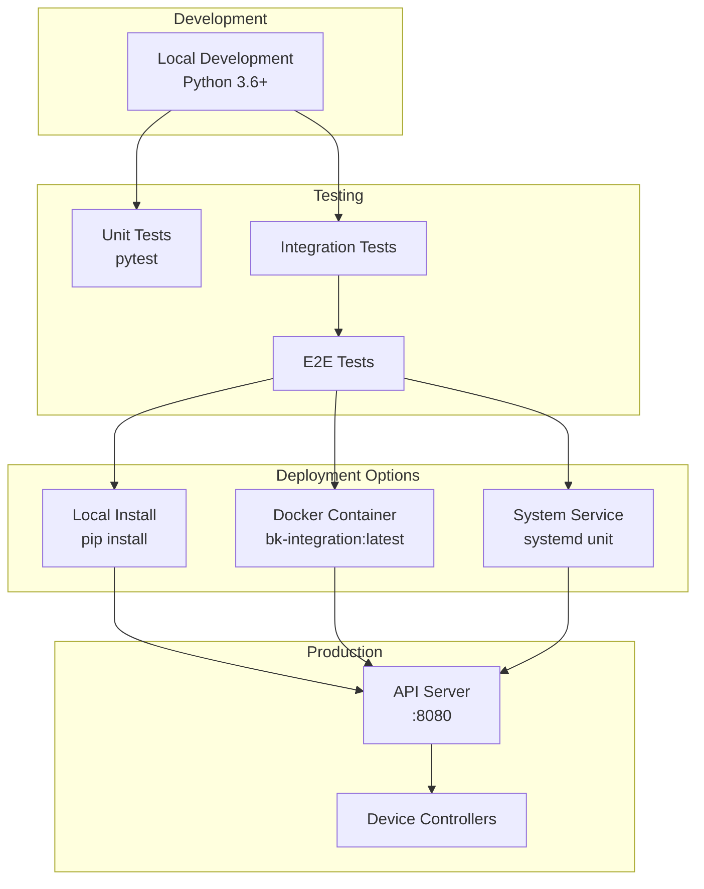

# BK-Integration Implementation Guide

## Architecture Overview

The BK-Integration CLI will serve as a unified control interface for both the BK8520 Electronic Load and BK9206b Power Supply, enabling comprehensive battery testing workflows through a single command-line application.

### System Architecture

### Component Interaction Flow

## Battery Testing Workflow

## State Management

## API Integration Architecture

## Data Flow Diagram

## Test Profile Configuration

## Deployment Architecture

---

*Note: The complete implementation details, code examples, installation instructions, and API reference can be found in the full documentation.*