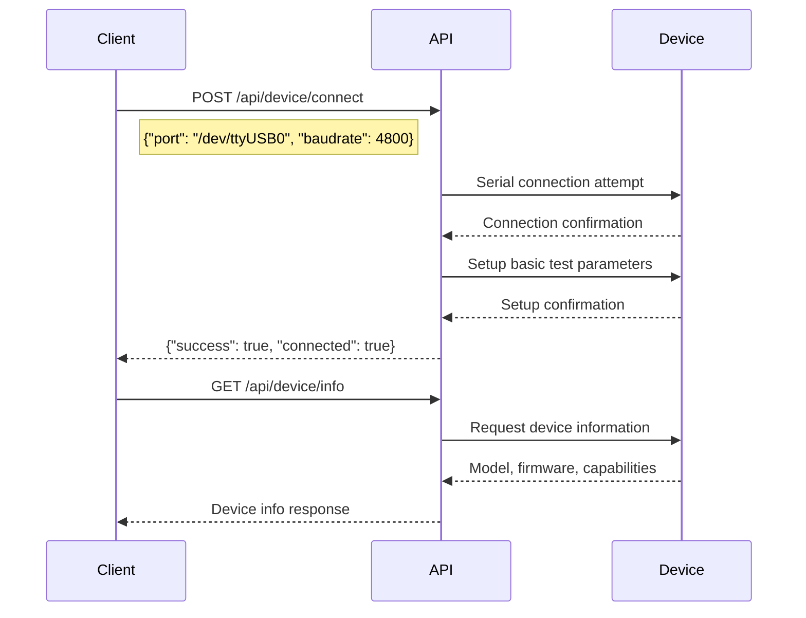
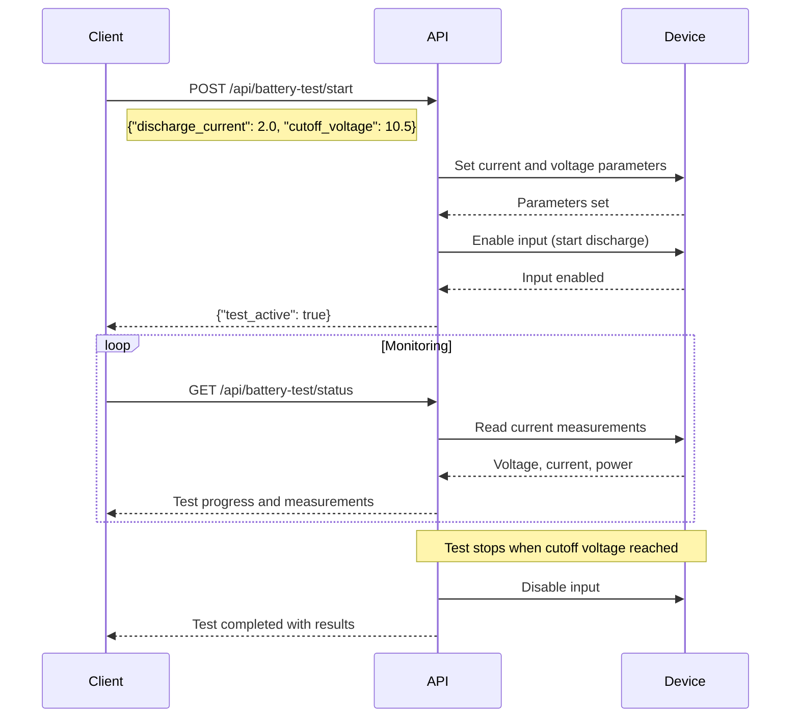

# BK8520 Electronic Load REST API Flow Diagram

This Mermaid diagram illustrates the POST and GET API endpoints for the BK8520 Electronic Load Control system.

## API Architecture Overview

```mermaid
graph TB
    subgraph "Client Applications"
        WEB[Web Interface]
        PYTHON[Python Client]
        CURL[cURL/CLI]
        JS[JavaScript Client]
    end

    subgraph "BK8520 REST API Server"
        subgraph "Health & System"
            HEALTH["GET /api/health<br/>📊 Check service status<br/>Returns: API health info"]
        end
        
        subgraph "Device Management"
            CONNECT["POST /api/device/connect<br/>🔌 Connect to BK8520<br/>Params: port, baudrate<br/>Action: Establish serial connection"]
            DISCONNECT["POST /api/device/disconnect<br/>🔌 Disconnect device<br/>Params: none<br/>Action: Close serial connection"]
            STATUS["GET /api/device/status<br/>📋 Get connection status<br/>Returns: connection state, device status"]
            INFO["GET /api/device/info<br/>ℹ️ Get device details<br/>Returns: model, firmware, capabilities"]
            READINGS["GET /api/device/readings<br/>⚡ Get live measurements<br/>Returns: voltage, current, power"]
        end
        
        subgraph "Device Control"
            INPUT["POST /api/device/input<br/>⚡ Control load input<br/>Params: enabled (true/false)<br/>Action: Turn input on/off"]
            CURRENT["POST /api/device/current<br/>⚡ Set discharge current<br/>Params: current (amperes)<br/>Action: Configure CC mode current"]
            VOLTAGE["POST /api/device/voltage<br/>⚡ Set cutoff voltage<br/>Params: voltage (volts)<br/>Action: Set battery protection limit"]
            MODE["POST /api/device/mode<br/>⚙️ Set operation mode<br/>Params: mode (0=CC,1=CV,2=CW,3=CR)<br/>Action: Change load operation mode"]
            MAXCURRENT["POST /api/device/max-current<br/>🛡️ Set current limit<br/>Params: current (amperes)<br/>Action: Configure safety limit"]
            MAXPOWER["POST /api/device/max-power<br/>🛡️ Set power limit<br/>Params: power (watts)<br/>Action: Configure safety limit"]
            MAXVOLTAGE["POST /api/device/max-voltage<br/>🛡️ Set voltage limit<br/>Params: voltage (volts)<br/>Action: Configure safety limit"]
            SETUP["POST /api/device/setup-discharge<br/>⚙️ Setup CC discharge<br/>Params: current (amperes)<br/>Action: Enable constant current mode"]
        end
        
        subgraph "Battery Testing"
            TESTSTART["POST /api/battery-test/start<br/>🔋 Start capacity test<br/>Params: discharge_current, cutoff_voltage<br/>Action: Begin automated test"]
            TESTSTOP["POST /api/battery-test/stop<br/>🛑 Stop active test<br/>Params: none<br/>Action: Halt test, save results"]
            TESTSTATUS["GET /api/battery-test/status<br/>📊 Get test progress<br/>Returns: test state, measurements<br/>Updates: capacity, elapsed time"]
            TESTRESULTS["GET /api/battery-test/results<br/>📈 Get complete results<br/>Returns: full test data<br/>Includes: capacity, duration, summary"]
        end
    end

    subgraph "BK8520 Hardware Device"
        DEVICE["BK8520 Electronic Load<br/>📡 Serial Communication<br/>Port: /dev/ttyUSB0<br/>Baudrate: 4800<br/>Max: 120V, 60A, 999W"]
    end

    %% Client connections
    WEB --> HEALTH
    WEB --> CONNECT
    WEB --> STATUS
    WEB --> READINGS
    WEB --> INPUT
    WEB --> TESTSTART
    WEB --> TESTSTATUS
    
    PYTHON --> CONNECT
    PYTHON --> CURRENT
    PYTHON --> VOLTAGE
    PYTHON --> TESTSTART
    PYTHON --> TESTRESULTS
    
    CURL --> HEALTH
    CURL --> INFO
    CURL --> MODE
    
    JS --> READINGS
    JS --> TESTSTATUS

    %% API to Device connections
    CONNECT --> DEVICE
    STATUS --> DEVICE
    INFO --> DEVICE
    READINGS --> DEVICE
    INPUT --> DEVICE
    CURRENT --> DEVICE
    VOLTAGE --> DEVICE
    MODE --> DEVICE
    MAXCURRENT --> DEVICE
    MAXPOWER --> DEVICE
    MAXVOLTAGE --> DEVICE
    SETUP --> DEVICE
    TESTSTART --> DEVICE
    TESTSTOP --> DEVICE
    TESTSTATUS --> DEVICE

    %% Styling
    classDef getEndpoint fill:#e1f5fe,stroke:#0277bd,stroke-width:2px
    classDef postEndpoint fill:#f3e5f5,stroke:#7b1fa2,stroke-width:2px
    classDef device fill:#fff3e0,stroke:#f57c00,stroke-width:3px
    classDef client fill:#e8f5e8,stroke:#388e3c,stroke-width:2px

    class HEALTH,STATUS,INFO,READINGS,TESTSTATUS,TESTRESULTS getEndpoint
    class CONNECT,DISCONNECT,INPUT,CURRENT,VOLTAGE,MODE,MAXCURRENT,MAXPOWER,MAXVOLTAGE,SETUP,TESTSTART,TESTSTOP postEndpoint
    class DEVICE device
    class WEB,PYTHON,CURL,JS client
```

## API Endpoint Details

### GET Endpoints (Data Retrieval)

| Endpoint | Purpose | Response Data |
|----------|---------|---------------|
| `GET /api/health` | Service health check | Status and version info |
| `GET /api/device/status` | Connection and operational status | Connection state, device status |
| `GET /api/device/info` | Device information | Model, firmware, capabilities |
| `GET /api/device/readings` | Real-time measurements | Voltage, current, power values |
| `GET /api/battery-test/status` | Active test status | Test progress, measurements |
| `GET /api/battery-test/results` | Complete test results | Full test data and summary |

### POST Endpoints (Control Operations)

| Endpoint | Purpose | Parameters |
|----------|---------|------------|
| `POST /api/device/connect` | Connect to device | Port, baudrate, timeout |
| `POST /api/device/disconnect` | Disconnect device | None |
| `POST /api/device/input` | Control input on/off | enabled (boolean) |
| `POST /api/device/current` | Set discharge current | current (amperes) |
| `POST /api/device/voltage` | Set cutoff voltage | voltage (volts) |
| `POST /api/device/mode` | Set operation mode | mode (0=CC, 1=CV, 2=CW, 3=CR) |
| `POST /api/device/max-current` | Set current limit | current (amperes) |
| `POST /api/device/max-power` | Set power limit | power (watts) |
| `POST /api/device/max-voltage` | Set voltage limit | voltage (volts) |
| `POST /api/device/setup-discharge` | Setup CC discharge | current (amperes) |
| `POST /api/battery-test/start` | Start battery test | discharge_current, cutoff_voltage, max_time_hours |
| `POST /api/battery-test/stop` | Stop battery test | None |

## Data Flow Examples

### Device Connection Flow

### Battery Test Flow

## System Architecture

The API server acts as a bridge between client applications and the physical BK8520 device:

- **FastAPI Server**: Handles HTTP requests and provides OpenAPI documentation
- **Serial Communication**: Direct communication with BK8520 via RS232/USB
- **Real-time Monitoring**: Continuous measurement reading during tests
- **Data Persistence**: Test results saved to JSON files
- **Error Handling**: Comprehensive error reporting and device safety checks

Base URL: `http://10.100.10.190:8000`