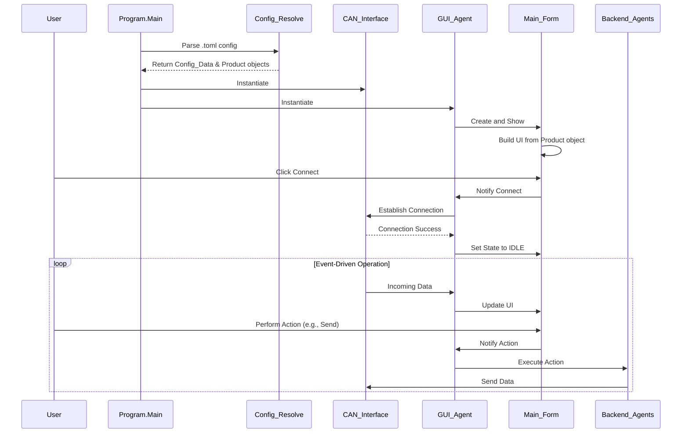

# Application Flow Diagram

This diagram illustrates the sequence of events and interactions between the major components of the `can-connector` application.

## Flow Description

1.  **Startup:** The application starts at `Program.Main`.
2.  **Configuration Loading:** It parses the specified `.toml` configuration file to create `Config_Data` and `Product` objects. These objects define the application's behavior and the target device's properties.
3.  **Initialization:** The core `CAN_Interface` and `GUI_Agent` components are instantiated.
4.  **UI Construction:** The `GUI_Agent` creates the `Main_Form`, which then dynamically builds its user interface based on the loaded `Product` profile.
5.  **Connection:** The user initiates a connection via the UI. The request flows from the `Main_Form` to the `GUI_Agent`, which then instructs the `CAN_Interface` to connect to the hardware.
6.  **Ready State:** Upon a successful connection, the `GUI_Agent` updates the `Main_Form`'s state to `IDLE`, enabling the main controls.
7.  **Event-Driven Operation:** The application enters its main loop:
    -   **Incoming Data:** Data received by the `CAN_Interface` is processed and forwarded to the `GUI_Agent`, which then updates the `Main_Form` to display the new information.
    -   **User Actions:** User interactions with the `Main_Form` are sent to the `GUI_Agent`, which delegates the tasks to the appropriate backend agents (e.g., `Send_Agent`, `Upgrade_Agent`). These agents then use the `CAN_Interface` to communicate with the device.
